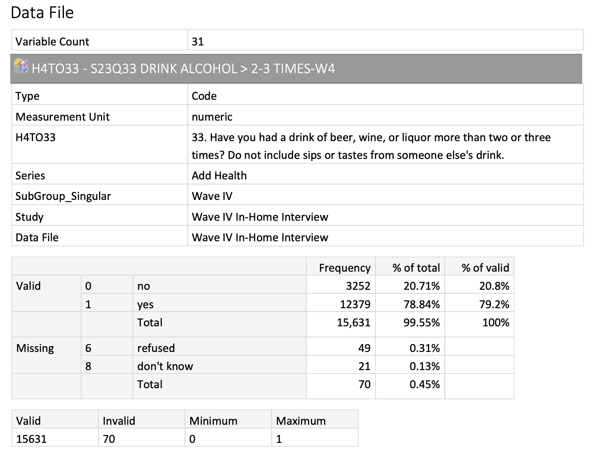
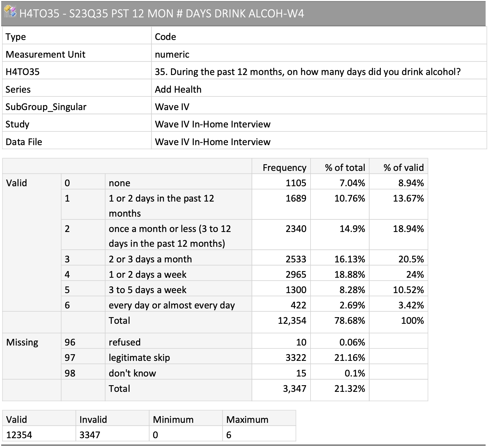

<!-- rnb-text-begin -->

---
title: "Ravienne UROP - Zoe's Code"
author: "Zoe Habel"
date: "2025-03-25"
output:
  github_document: default
  pdf_document: default
  html_notebook: default
header-includes:
- \usepackage{fvextra}
- \DefineVerbatimEnvironment{Highlighting}{Verbatim}{breaklines,commandchars=\\\{\}}
---

#### Loading packages


<!-- rnb-text-end -->


<!-- rnb-chunk-begin -->


<!-- rnb-output-begin eyJkYXRhIjoiXG48IS0tIHJuYi1zb3VyY2UtYmVnaW4gZXlKa1lYUmhJam9pWUdCZ2NseHViR2xpY21GeWVTaDBhV1I1ZG1WeWMyVXBJRnh1WUdCZ0luMD0gLS0+XG5cbmBgYHJcbmxpYnJhcnkodGlkeXZlcnNlKSBcbmBgYFxuXG48IS0tIHJuYi1zb3VyY2UtZW5kIC0tPlxuIn0= -->


<!-- rnb-source-begin eyJkYXRhIjoiYGBgclxubGlicmFyeSh0aWR5dmVyc2UpIFxuYGBgIn0= -->

```r
library(tidyverse) 
```

<!-- rnb-source-end -->


<!-- rnb-output-end -->

<!-- rnb-output-begin eyJkYXRhIjoi4pSA4pSAIEF0dGFjaGluZyBjb3JlIHRpZHl2ZXJzZSBwYWNrYWdlcyDilIDilIDilIDilIDilIDilIDilIDilIDilIDilIDilIDilIDilIDilIDilIDilIDilIDilIDilIDilIDilIDilIDilIDilIAgdGlkeXZlcnNlIDIuMC4wIOKUgOKUgFxu4pyUIGRwbHlyICAgICAxLjEuNCAgICAg4pyUIHJlYWRyICAgICAyLjEuNVxu4pyUIGZvcmNhdHMgICAxLjAuMCAgICAg4pyUIHN0cmluZ3IgICAxLjUuMVxu4pyUIGdncGxvdDIgICAzLjUuMSAgICAg4pyUIHRpYmJsZSAgICAzLjIuMVxu4pyUIGx1YnJpZGF0ZSAxLjkuNCAgICAg4pyUIHRpZHlyICAgICAxLjMuMVxu4pyUIHB1cnJyICAgICAxLjAuNCAgICAg4pSA4pSAIENvbmZsaWN0cyDilIDilIDilIDilIDilIDilIDilIDilIDilIDilIDilIDilIDilIDilIDilIDilIDilIDilIDilIDilIDilIDilIDilIDilIDilIDilIDilIDilIDilIDilIDilIDilIDilIDilIDilIDilIDilIDilIDilIDilIDilIDilIAgdGlkeXZlcnNlX2NvbmZsaWN0cygpIOKUgOKUgFxu4pyWIGRwbHlyOjpmaWx0ZXIoKSBtYXNrcyBzdGF0czo6ZmlsdGVyKClcbuKcliBkcGx5cjo6bGFnKCkgICAgbWFza3Mgc3RhdHM6OmxhZygpXG7ihLkgVXNlIHRoZSBcdTAwMWJdODs7aHR0cDovL2NvbmZsaWN0ZWQuci1saWIub3JnL1x1MDAwN2NvbmZsaWN0ZWQgcGFja2FnZVx1MDAxYl04OztcdTAwMDcgdG8gZm9yY2UgYWxsIGNvbmZsaWN0cyB0byBiZWNvbWUgZXJyb3JzXG4ifQ== -->

```
── Attaching core tidyverse packages ──────────────────────── tidyverse 2.0.0 ──
✔ dplyr     1.1.4     ✔ readr     2.1.5
✔ forcats   1.0.0     ✔ stringr   1.5.1
✔ ggplot2   3.5.1     ✔ tibble    3.2.1
✔ lubridate 1.9.4     ✔ tidyr     1.3.1
✔ purrr     1.0.4     ── Conflicts ────────────────────────────────────────── tidyverse_conflicts() ──
✖ dplyr::filter() masks stats::filter()
✖ dplyr::lag()    masks stats::lag()
ℹ Use the ]8;;http://conflicted.r-lib.org/conflicted package]8;; to force all conflicts to become errors
```


<!-- rnb-output-end -->

<!-- rnb-chunk-end -->


<!-- rnb-text-begin -->


*tidyverse includes dplyr*

#### Here's where I loaded my data locally


<!-- rnb-text-end -->


<!-- rnb-chunk-begin -->


<!-- rnb-output-begin eyJkYXRhIjoiXG48IS0tIHJuYi1zb3VyY2UtYmVnaW4gZXlKa1lYUmhJam9pWUdCZ2NseHViRzloWkNoY0luNHZSR1Z6YTNSdmNDOVJVRXd2ZFhKdmNGOXlZWFpwWlc1dVpTOUpRMUJUVWlCVlVrOVFJRVJoZEdFdlNVTlFVMUpmTWpFMk1EQWdOQzlFVXpBd01EVXZNakUyTURBdE1EQXdOUzFFWVhSaExuSmtZVndpS1Z4dWJHOWhaQ2hjSW40dlJHVnphM1J2Y0M5UlVFd3ZkWEp2Y0Y5eVlYWnBaVzV1WlM5SlExQlRVaUJWVWs5UUlFUmhkR0V2U1VOUVUxSmZNakUyTURBdlJGTXdNREF4THpJeE5qQXdMVEF3TURFdFJHRjBZUzV5WkdGY0lpbGNibXh2WVdRb1hDSitMMFJsYzJ0MGIzQXZVVkJNTDNWeWIzQmZjbUYyYVdWdWJtVXZTVU5RVTFJZ1ZWSlBVQ0JFWVhSaEwwbERVRk5TWHpJeE5qQXdJRGd2UkZNd01ESXlMekl4TmpBd0xUQXdNakl0UkdGMFlTNXlaR0ZjSWlsY2JtQmdZQ0o5IC0tPlxuXG5gYGByXG5sb2FkKFwifi9EZXNrdG9wL1FQTC91cm9wX3Jhdmllbm5lL0lDUFNSIFVST1AgRGF0YS9JQ1BTUl8yMTYwMCA0L0RTMDAwNS8yMTYwMC0wMDA1LURhdGEucmRhXCIpXG5sb2FkKFwifi9EZXNrdG9wL1FQTC91cm9wX3Jhdmllbm5lL0lDUFNSIFVST1AgRGF0YS9JQ1BTUl8yMTYwMC9EUzAwMDEvMjE2MDAtMDAwMS1EYXRhLnJkYVwiKVxubG9hZChcIn4vRGVza3RvcC9RUEwvdXJvcF9yYXZpZW5uZS9JQ1BTUiBVUk9QIERhdGEvSUNQU1JfMjE2MDAgOC9EUzAwMjIvMjE2MDAtMDAyMi1EYXRhLnJkYVwiKVxuYGBgXG5cbjwhLS0gcm5iLXNvdXJjZS1lbmQgLS0+XG4ifQ== -->


<!-- rnb-source-begin eyJkYXRhIjoiYGBgclxubG9hZChcIn4vRGVza3RvcC9RUEwvdXJvcF9yYXZpZW5uZS9JQ1BTUiBVUk9QIERhdGEvSUNQU1JfMjE2MDAgNC9EUzAwMDUvMjE2MDAtMDAwNS1EYXRhLnJkYVwiKVxubG9hZChcIn4vRGVza3RvcC9RUEwvdXJvcF9yYXZpZW5uZS9JQ1BTUiBVUk9QIERhdGEvSUNQU1JfMjE2MDAvRFMwMDAxLzIxNjAwLTAwMDEtRGF0YS5yZGFcIilcbmxvYWQoXCJ+L0Rlc2t0b3AvUVBML3Vyb3BfcmF2aWVubmUvSUNQU1IgVVJPUCBEYXRhL0lDUFNSXzIxNjAwIDgvRFMwMDIyLzIxNjAwLTAwMjItRGF0YS5yZGFcIilcbmBgYCJ9 -->

```r
load("~/Desktop/QPL/urop_ravienne/ICPSR UROP Data/ICPSR_21600 4/DS0005/21600-0005-Data.rda")
load("~/Desktop/QPL/urop_ravienne/ICPSR UROP Data/ICPSR_21600/DS0001/21600-0001-Data.rda")
load("~/Desktop/QPL/urop_ravienne/ICPSR UROP Data/ICPSR_21600 8/DS0022/21600-0022-Data.rda")
```

<!-- rnb-source-end -->


<!-- rnb-output-end -->

<!-- rnb-chunk-end -->


<!-- rnb-text-begin -->


#### [google sheet link :)](https://docs.google.com/spreadsheets/d/1Qvp9XRvgWT0kIqNywmpVKmovxEQQrm3WWV7K6oD7JFQ/edit?gid=0#gid=0)

## **Zoe's code as of 3/19/2025**

### Step 1: selecting the variables from each wave and organizing them


<!-- rnb-text-end -->


<!-- rnb-chunk-begin -->


<!-- rnb-output-begin eyJkYXRhIjoiXG48IS0tIHJuYi1zb3VyY2UtYmVnaW4gZXlKa1lYUmhJam9pWUdCZ2NseHVJM2RoZG1VZ01TQjJZWEpwWVdKc1pYTmNibVJoZEdGZmQyRjJaVEVnUEMwZ1pHRXlNVFl3TUM0d01EQXhJSHcrSUZ4dUlDQnpaV3hsWTNRb1hHNGdJQ0FnUVVsRUxDQklNVlJQTVRJc0lFZ3hWRTh4TjF4dUlDQXBYRzRqZDJGMlpTQXlJSFpoY21saFlteGxjMXh1WkdGMFlWOTNZWFpsTWlBOExTQmtZVEl4TmpBd0xqQXdNRFVnZkQ0Z1hHNGdJSE5sYkdWamRDaGNiaUFnSUNCQlNVUXNJRWd5UlVReE9Td2dTREpGUkRFM0xDQklNbEJTTVN3Z1NESlFVaklzSUVneVVGSXpMQ0JJTWxCU05GeHVJQ0FwWEc0amQyRjJaU0EwSUhaaGNtbGhZbXhsYzF4dVpHRjBZVjkzWVhabE5DQThMU0JrWVRJeE5qQXdMakF3TWpJZ2ZENWNiaUFnYzJWc1pXTjBLRnh1SUNBZ0lFRkpSQ3hjYmlBZ0lDQklORTFCTVN4Y2JpQWdJQ0JJTkUxQk15eGNiaUFnSUNCSU5FMUJOU3hjYmlBZ0lDQklORlJQTlRFc1hHNGdJQ0FnU0RSVVR6VTRMRnh1SUNBZ0lFZzBWRTgwTml4Y2JpQWdJQ0JJTkZSUE5EZ3NYRzRnSUNBZ1NEUlVUelV5TEZ4dUlDQWdJRWcwVkU4ME55eGNiaUFnSUNCSU5GUlBOVE1zWEc0Z0lDQWdTRFJVVHpVMExGeHVJQ0FnSUVnMFZFODFOU3hjYmlBZ0lDQklORlJQTlRZc1hHNGdJQ0FnU0RSVVR6VTVMRnh1SUNBZ0lFZzBWRTgyTUN4Y2JpQWdJQ0JJTkZSUE5qRXNYRzRnSUNBZ1NEUlVUell5WEc0Z0lDbGNibUJnWUNKOSAtLT5cblxuYGBgclxuI3dhdmUgMSB2YXJpYWJsZXNcbmRhdGFfd2F2ZTEgPC0gZGEyMTYwMC4wMDAxIHw+IFxuICBzZWxlY3QoXG4gICAgQUlELCBIMVRPMTIsIEgxVE8xN1xuICApXG4jd2F2ZSAyIHZhcmlhYmxlc1xuZGF0YV93YXZlMiA8LSBkYTIxNjAwLjAwMDUgfD4gXG4gIHNlbGVjdChcbiAgICBBSUQsIEgyRUQxOSwgSDJFRDE3LCBIMlBSMSwgSDJQUjIsIEgyUFIzLCBIMlBSNFxuICApXG4jd2F2ZSA0IHZhcmlhYmxlc1xuZGF0YV93YXZlNCA8LSBkYTIxNjAwLjAwMjIgfD5cbiAgc2VsZWN0KFxuICAgIEFJRCxcbiAgICBINE1BMSxcbiAgICBINE1BMyxcbiAgICBINE1BNSxcbiAgICBINFRPNTEsXG4gICAgSDRUTzU4LFxuICAgIEg0VE80NixcbiAgICBINFRPNDgsXG4gICAgSDRUTzUyLFxuICAgIEg0VE80NyxcbiAgICBINFRPNTMsXG4gICAgSDRUTzU0LFxuICAgIEg0VE81NSxcbiAgICBINFRPNTYsXG4gICAgSDRUTzU5LFxuICAgIEg0VE82MCxcbiAgICBINFRPNjEsXG4gICAgSDRUTzYyXG4gIClcbmBgYFxuXG48IS0tIHJuYi1zb3VyY2UtZW5kIC0tPlxuIn0= -->


<!-- rnb-source-begin eyJkYXRhIjoiYGBgclxuI3dhdmUgMSB2YXJpYWJsZXNcbmRhdGFfd2F2ZTEgPC0gZGEyMTYwMC4wMDAxIHw+IFxuICBzZWxlY3QoXG4gICAgQUlELCBIMVRPMTIsIEgxVE8xN1xuICApXG4jd2F2ZSAyIHZhcmlhYmxlc1xuZGF0YV93YXZlMiA8LSBkYTIxNjAwLjAwMDUgfD4gXG4gIHNlbGVjdChcbiAgICBBSUQsIEgyRUQxOSwgSDJFRDE3LCBIMlBSMSwgSDJQUjIsIEgyUFIzLCBIMlBSNFxuICApXG4jd2F2ZSA0IHZhcmlhYmxlc1xuZGF0YV93YXZlNCA8LSBkYTIxNjAwLjAwMjIgfD5cbiAgc2VsZWN0KFxuICAgIEFJRCxcbiAgICBINE1BMSxcbiAgICBINE1BMyxcbiAgICBINE1BNSxcbiAgICBINFRPNTEsXG4gICAgSDRUTzU4LFxuICAgIEg0VE80NixcbiAgICBINFRPNDgsXG4gICAgSDRUTzUyLFxuICAgIEg0VE80NyxcbiAgICBINFRPNTMsXG4gICAgSDRUTzU0LFxuICAgIEg0VE81NSxcbiAgICBINFRPNTYsXG4gICAgSDRUTzU5LFxuICAgIEg0VE82MCxcbiAgICBINFRPNjEsXG4gICAgSDRUTzYyXG4gIClcbmBgYCJ9 -->

```r
#wave 1 variables
data_wave1 <- da21600.0001 |> 
  select(
    AID, H1TO12, H1TO17
  )
#wave 2 variables
data_wave2 <- da21600.0005 |> 
  select(
    AID, H2ED19, H2ED17, H2PR1, H2PR2, H2PR3, H2PR4
  )
#wave 4 variables
data_wave4 <- da21600.0022 |>
  select(
    AID,
    H4MA1,
    H4MA3,
    H4MA5,
    H4TO51,
    H4TO58,
    H4TO46,
    H4TO48,
    H4TO52,
    H4TO47,
    H4TO53,
    H4TO54,
    H4TO55,
    H4TO56,
    H4TO59,
    H4TO60,
    H4TO61,
    H4TO62
  )
```

<!-- rnb-source-end -->


<!-- rnb-output-end -->

<!-- rnb-chunk-end -->


<!-- rnb-text-begin -->


if else yes - H4TO33 -> skip all other alc questions
legit skip # : 3322 for H4TO34 & H4TO35
H4TO35 -> if missing or none - skip H4TO36:H4TO39 
legit skip # : 4427 for H4TO36:H4TO39 
legit skip # : 6307 for H4TO40 & H4TO41


### Step 2: merging the variables by AID


<!-- rnb-text-end -->


<!-- rnb-chunk-begin -->


<!-- rnb-output-begin eyJkYXRhIjoiXG48IS0tIHJuYi1zb3VyY2UtYmVnaW4gZXlKa1lYUmhJam9pWUdCZ2NseHVaR0YwWVY5M1lYWmxjekZoYm1ReUlEd3RJRzFsY21kbEtGeHVJQ0JrWVhSaFgzZGhkbVV4TENCY2JpQWdaR0YwWVY5M1lYWmxNaXdnWEc0Z0lHSjVJRDBnWENKQlNVUmNJbHh1S1Z4dVpHRjBZVjkzWVhabGN6RXlOQ0E4TFNCdFpYSm5aU2hjYmlBZ1pHRjBZVjkzWVhabGN6RmhibVF5TEZ4dUlDQmtZWFJoWDNkaGRtVTBMRnh1SUNCaWVTQTlJRndpUVVsRVhDSmNiaWxjYm1CZ1lDSjkgLS0+XG5cbmBgYHJcbmRhdGFfd2F2ZXMxYW5kMiA8LSBtZXJnZShcbiAgZGF0YV93YXZlMSwgXG4gIGRhdGFfd2F2ZTIsIFxuICBieSA9IFwiQUlEXCJcbilcbmRhdGFfd2F2ZXMxMjQgPC0gbWVyZ2UoXG4gIGRhdGFfd2F2ZXMxYW5kMixcbiAgZGF0YV93YXZlNCxcbiAgYnkgPSBcIkFJRFwiXG4pXG5gYGBcblxuPCEtLSBybmItc291cmNlLWVuZCAtLT5cbiJ9 -->


<!-- rnb-source-begin eyJkYXRhIjoiYGBgclxuZGF0YV93YXZlczFhbmQyIDwtIG1lcmdlKFxuICBkYXRhX3dhdmUxLCBcbiAgZGF0YV93YXZlMiwgXG4gIGJ5ID0gXCJBSURcIlxuKVxuZGF0YV93YXZlczEyNCA8LSBtZXJnZShcbiAgZGF0YV93YXZlczFhbmQyLFxuICBkYXRhX3dhdmU0LFxuICBieSA9IFwiQUlEXCJcbilcbmBgYCJ9 -->

```r
data_waves1and2 <- merge(
  data_wave1, 
  data_wave2, 
  by = "AID"
)
data_waves124 <- merge(
  data_waves1and2,
  data_wave4,
  by = "AID"
)
```

<!-- rnb-source-end -->


<!-- rnb-output-end -->

<!-- rnb-chunk-end -->


<!-- rnb-text-begin -->


### Step 3: Using the dplyr function mutate to combine variables from subvariables e.g. ACEs

#### ACES


<!-- rnb-text-end -->


<!-- rnb-chunk-begin -->


<!-- rnb-output-begin eyJkYXRhIjoiXG48IS0tIHJuYi1zb3VyY2UtYmVnaW4gZXlKa1lYUmhJam9pWUdCZ2NseHVaR0YwWVY5M1lYWmxjekV5TkNSbGJXOTBhVzl1WVd4ZllXSjFjMlVnUEMwZ1lYTXViblZ0WlhKcFl5aGtZWFJoWDNkaGRtVnpNVEkwSkVnMFRVRXhJRDA5SUZ3aUtEVXBJQ2cxS1NCTmIzSmxJSFJvWVc0Z2RHVnVJSFJwYldWelhDSXBYRzVrWVhSaFgzZGhkbVZ6TVRJMEpIQm9lWE5wWTJGc1gyRmlkWE5sSUR3dElHRnpMbTUxYldWeWFXTW9YRzRnSUdSaGRHRmZkMkYyWlhNeE1qUWtTRFJOUVRNZ1BUMGdYQ0lvTXlrZ0tETXBJRlJvY21WbElIUnZJR1pwZG1VZ2RHbHRaWE5jSWlCOFhHNGdJQ0FnWkdGMFlWOTNZWFpsY3pFeU5DUklORTFCTXlBOVBTQmNJaWcwS1NBb05Da2dVMmw0SUhSdklIUmxiaUIwYVcxbGMxd2lJSHhjYmlBZ0lDQmtZWFJoWDNkaGRtVnpNVEkwSkVnMFRVRXpJRDA5SUZ3aUtEVXBJQ2cxS1NCTmIzSmxJSFJvWVc0Z2RHVnVJSFJwYldWelhDSmNiaWxjYm1SaGRHRmZkMkYyWlhNeE1qUWtjMlY0ZFdGc1gyRmlkWE5sSUR3dElHRnpMbTUxYldWeWFXTW9aR0YwWVY5M1lYWmxjekV5TkNSSU5FMUJOU0FoUFNCY0lpZzJLU0FvTmlrZ1ZHaHBjeUJvWVhNZ2JtVjJaWElnYUdGd2NHVnVaV1JjSWlsY2JtUmhkR0ZmZDJGMlpYTXhNalFnUEMwZ1pHRjBZVjkzWVhabGN6RXlOQ0I4UGx4dUlDQnRkWFJoZEdVb1lXTmxjeUE5SUdWdGIzUnBiMjVoYkY5aFluVnpaU0FySUhCb2VYTnBZMkZzWDJGaWRYTmxJQ3NnYzJWNGRXRnNYMkZpZFhObEtWeHVZR0JnSW4wPSAtLT5cblxuYGBgclxuZGF0YV93YXZlczEyNCRlbW90aW9uYWxfYWJ1c2UgPC0gYXMubnVtZXJpYyhkYXRhX3dhdmVzMTI0JEg0TUExID09IFwiKDUpICg1KSBNb3JlIHRoYW4gdGVuIHRpbWVzXCIpXG5kYXRhX3dhdmVzMTI0JHBoeXNpY2FsX2FidXNlIDwtIGFzLm51bWVyaWMoXG4gIGRhdGFfd2F2ZXMxMjQkSDRNQTMgPT0gXCIoMykgKDMpIFRocmVlIHRvIGZpdmUgdGltZXNcIiB8XG4gICAgZGF0YV93YXZlczEyNCRINE1BMyA9PSBcIig0KSAoNCkgU2l4IHRvIHRlbiB0aW1lc1wiIHxcbiAgICBkYXRhX3dhdmVzMTI0JEg0TUEzID09IFwiKDUpICg1KSBNb3JlIHRoYW4gdGVuIHRpbWVzXCJcbilcbmRhdGFfd2F2ZXMxMjQkc2V4dWFsX2FidXNlIDwtIGFzLm51bWVyaWMoZGF0YV93YXZlczEyNCRINE1BNSAhPSBcIig2KSAoNikgVGhpcyBoYXMgbmV2ZXIgaGFwcGVuZWRcIilcbmRhdGFfd2F2ZXMxMjQgPC0gZGF0YV93YXZlczEyNCB8PlxuICBtdXRhdGUoYWNlcyA9IGVtb3Rpb25hbF9hYnVzZSArIHBoeXNpY2FsX2FidXNlICsgc2V4dWFsX2FidXNlKVxuYGBgXG5cbjwhLS0gcm5iLXNvdXJjZS1lbmQgLS0+XG4ifQ== -->


<!-- rnb-source-begin eyJkYXRhIjoiYGBgclxuZGF0YV93YXZlczEyNCRlbW90aW9uYWxfYWJ1c2UgPC0gYXMubnVtZXJpYyhkYXRhX3dhdmVzMTI0JEg0TUExID09IFwiKDUpICg1KSBNb3JlIHRoYW4gdGVuIHRpbWVzXCIpXG5kYXRhX3dhdmVzMTI0JHBoeXNpY2FsX2FidXNlIDwtIGFzLm51bWVyaWMoXG4gIGRhdGFfd2F2ZXMxMjQkSDRNQTMgPT0gXCIoMykgKDMpIFRocmVlIHRvIGZpdmUgdGltZXNcIiB8XG4gICAgZGF0YV93YXZlczEyNCRINE1BMyA9PSBcIig0KSAoNCkgU2l4IHRvIHRlbiB0aW1lc1wiIHxcbiAgICBkYXRhX3dhdmVzMTI0JEg0TUEzID09IFwiKDUpICg1KSBNb3JlIHRoYW4gdGVuIHRpbWVzXCJcbilcbmRhdGFfd2F2ZXMxMjQkc2V4dWFsX2FidXNlIDwtIGFzLm51bWVyaWMoZGF0YV93YXZlczEyNCRINE1BNSAhPSBcIig2KSAoNikgVGhpcyBoYXMgbmV2ZXIgaGFwcGVuZWRcIilcbmRhdGFfd2F2ZXMxMjQgPC0gZGF0YV93YXZlczEyNCB8PlxuICBtdXRhdGUoYWNlcyA9IGVtb3Rpb25hbF9hYnVzZSArIHBoeXNpY2FsX2FidXNlICsgc2V4dWFsX2FidXNlKVxuYGBgIn0= -->

```r
data_waves124$emotional_abuse <- as.numeric(data_waves124$H4MA1 == "(5) (5) More than ten times")
data_waves124$physical_abuse <- as.numeric(
  data_waves124$H4MA3 == "(3) (3) Three to five times" |
    data_waves124$H4MA3 == "(4) (4) Six to ten times" |
    data_waves124$H4MA3 == "(5) (5) More than ten times"
)
data_waves124$sexual_abuse <- as.numeric(data_waves124$H4MA5 != "(6) (6) This has never happened")
data_waves124 <- data_waves124 |>
  mutate(aces = emotional_abuse + physical_abuse + sexual_abuse)
```

<!-- rnb-source-end -->


<!-- rnb-output-end -->

<!-- rnb-chunk-end -->


<!-- rnb-text-begin -->


### Step 3.2: Creating composites for trickier variables

#### perceived discriminiation & social support


<!-- rnb-text-end -->


<!-- rnb-chunk-begin -->


<!-- rnb-output-begin eyJkYXRhIjoiXG48IS0tIHJuYi1zb3VyY2UtYmVnaW4gZXlKa1lYUmhJam9pWUdCZ2NseHVJM0JsY21ObGFYWmxaQ0JrYVhOamNtbHRhVzVwWVhScGIyNWNibVJoZEdGZmQyRjJaWE14TWpRa2RHVmhZMmhsY2w5a2FYTmpjbWx0YVc1aGRHbHZiaUE4TFNCa1lYUmhYM2RoZG1Wek1USTBKRWd5UlVReE9TQjhQbHh1SUNCbVkzUmZjbVYyS0NrZ2ZENWNiaUFnWVhNdWJuVnRaWEpwWXlncFhHNWNibVJoZEdGZmQyRjJaWE14TWpRa2NHVmxjbDl3Y21WcWRXUnBZMlVnUEMwZ1pHRjBZVjkzWVhabGN6RXlOQ1JJTWtWRU1UY2dmRDVjYmlBZ1ptTjBYM0psZGlncElIdytYRzRnSUdGekxtNTFiV1Z5YVdNb0tWeHVYRzVrWVhSaFgzZGhkbVZ6TVRJMElEd3RJR1JoZEdGZmQyRjJaWE14TWpRZ2ZENGdiWFYwWVhSbEtGeHVJQ0FvY0dWeVkyVnBkbVZrWDJScGMyTnlhVzFwYm1GMGFXOXVJRDBnY21Wd2JHRmpaVjl1WVNoMFpXRmphR1Z5WDJScGMyTnlhVzFwYm1GMGFXOXVMQ0F3S1NBclhHNGdJQ0FnSUNBZ0lDQWdJQ0FnSUNCeVpYQnNZV05sWDI1aEtIQmxaWEpmY0hKbGFuVmthV05sTENBd0tTa3BYRzRqY0dWeVkyVnBkbVZrSUhOdlkybGhiQ0J6ZFhCd2IzSjBYRzVrWVhSaFgzZGhkbVZ6TVRJMEpHRmtkV3gwWDNOMWNIQnZjblFnUEMwZ1pHRjBZVjkzWVhabGN6RXlOQ1JJTWxCU01TQjhQbHh1SUNCbVkzUmZjbVYyS0NrZ2ZENWNiaUFnWVhNdWJuVnRaWEpwWXlncFhHNWtZWFJoWDNkaGRtVnpNVEkwSkhSbFlXTm9aWEpmYzNWd2NHOXlkQ0E4TFNCa1lYUmhYM2RoZG1Wek1USTBKRWd5VUZJeUlIdytYRzRnSUdaamRGOXlaWFlvS1NCOFBseHVJQ0JoY3k1dWRXMWxjbWxqS0NsY2JtUmhkR0ZmZDJGMlpYTXhNalFrY0dGeVpXNTBYM04xY0hCdmNuUWdQQzBnWkdGMFlWOTNZWFpsY3pFeU5DUklNbEJTTXlCOFBseHVJQ0JtWTNSZmNtVjJLQ2tnZkQ1Y2JpQWdZWE11Ym5WdFpYSnBZeWdwWEc1a1lYUmhYM2RoZG1Wek1USTBKSEJsWlhKZmMzVndjRzl5ZENBOExTQmtZWFJoWDNkaGRtVnpNVEkwSkVneVVGSTBJSHcrWEc0Z0lHWmpkRjl5WlhZb0tTQjhQbHh1SUNCaGN5NXVkVzFsY21saktDbGNibHh1WkdGMFlWOTNZWFpsY3pFeU5DQThMU0JrWVhSaFgzZGhkbVZ6TVRJMElIdytYRzRnSUcxMWRHRjBaU2h3WlhKalpXbDJaV1JmYzI5amFXRnNYM04xY0hCdmNuUWdQVnh1SUNBZ0lISmxjR3hoWTJWZmJtRW9ZV1IxYkhSZmMzVndjRzl5ZEN3Z01Da2dLeUJ5WlhCc1lXTmxYMjVoS0hSbFlXTm9aWEpmYzNWd2NHOXlkQ3dnTUNsY2JpQWdJQ0FySUhKbGNHeGhZMlZmYm1Fb2NHRnlaVzUwWDNOMWNIQnZjblFzSURBcElDc2djbVZ3YkdGalpWOXVZU2h3WldWeVgzTjFjSEJ2Y25Rc0lEQXBYRzRnSUNsY2JtQmdZQ0o5IC0tPlxuXG5gYGByXG4jcGVyY2VpdmVkIGRpc2NyaW1pbmlhdGlvblxuZGF0YV93YXZlczEyNCR0ZWFjaGVyX2Rpc2NyaW1pbmF0aW9uIDwtIGRhdGFfd2F2ZXMxMjQkSDJFRDE5IHw+XG4gIGZjdF9yZXYoKSB8PlxuICBhcy5udW1lcmljKClcblxuZGF0YV93YXZlczEyNCRwZWVyX3ByZWp1ZGljZSA8LSBkYXRhX3dhdmVzMTI0JEgyRUQxNyB8PlxuICBmY3RfcmV2KCkgfD5cbiAgYXMubnVtZXJpYygpXG5cbmRhdGFfd2F2ZXMxMjQgPC0gZGF0YV93YXZlczEyNCB8PiBtdXRhdGUoXG4gIChwZXJjZWl2ZWRfZGlzY3JpbWluYXRpb24gPSByZXBsYWNlX25hKHRlYWNoZXJfZGlzY3JpbWluYXRpb24sIDApICtcbiAgICAgICAgICAgICAgIHJlcGxhY2VfbmEocGVlcl9wcmVqdWRpY2UsIDApKSlcbiNwZXJjZWl2ZWQgc29jaWFsIHN1cHBvcnRcbmRhdGFfd2F2ZXMxMjQkYWR1bHRfc3VwcG9ydCA8LSBkYXRhX3dhdmVzMTI0JEgyUFIxIHw+XG4gIGZjdF9yZXYoKSB8PlxuICBhcy5udW1lcmljKClcbmRhdGFfd2F2ZXMxMjQkdGVhY2hlcl9zdXBwb3J0IDwtIGRhdGFfd2F2ZXMxMjQkSDJQUjIgfD5cbiAgZmN0X3JldigpIHw+XG4gIGFzLm51bWVyaWMoKVxuZGF0YV93YXZlczEyNCRwYXJlbnRfc3VwcG9ydCA8LSBkYXRhX3dhdmVzMTI0JEgyUFIzIHw+XG4gIGZjdF9yZXYoKSB8PlxuICBhcy5udW1lcmljKClcbmRhdGFfd2F2ZXMxMjQkcGVlcl9zdXBwb3J0IDwtIGRhdGFfd2F2ZXMxMjQkSDJQUjQgfD5cbiAgZmN0X3JldigpIHw+XG4gIGFzLm51bWVyaWMoKVxuXG5kYXRhX3dhdmVzMTI0IDwtIGRhdGFfd2F2ZXMxMjQgfD5cbiAgbXV0YXRlKHBlcmNlaXZlZF9zb2NpYWxfc3VwcG9ydCA9XG4gICAgcmVwbGFjZV9uYShhZHVsdF9zdXBwb3J0LCAwKSArIHJlcGxhY2VfbmEodGVhY2hlcl9zdXBwb3J0LCAwKVxuICAgICsgcmVwbGFjZV9uYShwYXJlbnRfc3VwcG9ydCwgMCkgKyByZXBsYWNlX25hKHBlZXJfc3VwcG9ydCwgMClcbiAgKVxuYGBgXG5cbjwhLS0gcm5iLXNvdXJjZS1lbmQgLS0+XG4ifQ== -->


<!-- rnb-source-begin eyJkYXRhIjoiYGBgclxuI3BlcmNlaXZlZCBkaXNjcmltaW5pYXRpb25cbmRhdGFfd2F2ZXMxMjQkdGVhY2hlcl9kaXNjcmltaW5hdGlvbiA8LSBkYXRhX3dhdmVzMTI0JEgyRUQxOSB8PlxuICBmY3RfcmV2KCkgfD5cbiAgYXMubnVtZXJpYygpXG5cbmRhdGFfd2F2ZXMxMjQkcGVlcl9wcmVqdWRpY2UgPC0gZGF0YV93YXZlczEyNCRIMkVEMTcgfD5cbiAgZmN0X3JldigpIHw+XG4gIGFzLm51bWVyaWMoKVxuXG5kYXRhX3dhdmVzMTI0IDwtIGRhdGFfd2F2ZXMxMjQgfD4gbXV0YXRlKFxuICAocGVyY2VpdmVkX2Rpc2NyaW1pbmF0aW9uID0gcmVwbGFjZV9uYSh0ZWFjaGVyX2Rpc2NyaW1pbmF0aW9uLCAwKSArXG4gICAgICAgICAgICAgICByZXBsYWNlX25hKHBlZXJfcHJlanVkaWNlLCAwKSkpXG4jcGVyY2VpdmVkIHNvY2lhbCBzdXBwb3J0XG5kYXRhX3dhdmVzMTI0JGFkdWx0X3N1cHBvcnQgPC0gZGF0YV93YXZlczEyNCRIMlBSMSB8PlxuICBmY3RfcmV2KCkgfD5cbiAgYXMubnVtZXJpYygpXG5kYXRhX3dhdmVzMTI0JHRlYWNoZXJfc3VwcG9ydCA8LSBkYXRhX3dhdmVzMTI0JEgyUFIyIHw+XG4gIGZjdF9yZXYoKSB8PlxuICBhcy5udW1lcmljKClcbmRhdGFfd2F2ZXMxMjQkcGFyZW50X3N1cHBvcnQgPC0gZGF0YV93YXZlczEyNCRIMlBSMyB8PlxuICBmY3RfcmV2KCkgfD5cbiAgYXMubnVtZXJpYygpXG5kYXRhX3dhdmVzMTI0JHBlZXJfc3VwcG9ydCA8LSBkYXRhX3dhdmVzMTI0JEgyUFI0IHw+XG4gIGZjdF9yZXYoKSB8PlxuICBhcy5udW1lcmljKClcblxuZGF0YV93YXZlczEyNCA8LSBkYXRhX3dhdmVzMTI0IHw+XG4gIG11dGF0ZShwZXJjZWl2ZWRfc29jaWFsX3N1cHBvcnQgPVxuICAgIHJlcGxhY2VfbmEoYWR1bHRfc3VwcG9ydCwgMCkgKyByZXBsYWNlX25hKHRlYWNoZXJfc3VwcG9ydCwgMClcbiAgICArIHJlcGxhY2VfbmEocGFyZW50X3N1cHBvcnQsIDApICsgcmVwbGFjZV9uYShwZWVyX3N1cHBvcnQsIDApXG4gIClcbmBgYCJ9 -->

```r
#perceived discriminiation
data_waves124$teacher_discrimination <- data_waves124$H2ED19 |>
  fct_rev() |>
  as.numeric()

data_waves124$peer_prejudice <- data_waves124$H2ED17 |>
  fct_rev() |>
  as.numeric()

data_waves124 <- data_waves124 |> mutate(
  (perceived_discrimination = replace_na(teacher_discrimination, 0) +
               replace_na(peer_prejudice, 0)))
#perceived social support
data_waves124$adult_support <- data_waves124$H2PR1 |>
  fct_rev() |>
  as.numeric()
data_waves124$teacher_support <- data_waves124$H2PR2 |>
  fct_rev() |>
  as.numeric()
data_waves124$parent_support <- data_waves124$H2PR3 |>
  fct_rev() |>
  as.numeric()
data_waves124$peer_support <- data_waves124$H2PR4 |>
  fct_rev() |>
  as.numeric()

data_waves124 <- data_waves124 |>
  mutate(perceived_social_support =
    replace_na(adult_support, 0) + replace_na(teacher_support, 0)
    + replace_na(parent_support, 0) + replace_na(peer_support, 0)
  )
```

<!-- rnb-source-end -->


<!-- rnb-output-end -->

<!-- rnb-chunk-end -->


<!-- rnb-text-begin -->


### Step 3.3: Cleaning + creating composites for questions related to problematic alcohol use

#### Domain approach + study skip logic


<!-- rnb-text-end -->


<!-- rnb-chunk-begin -->


<!-- rnb-output-begin eyJkYXRhIjoiXG48IS0tIHJuYi1zb3VyY2UtYmVnaW4gZXlKa1lYUmhJam9pWUdCZ2NseHVJMlZoY214NUlHeHBabVVnYzNWaWMzUmhibU5sSUhWelpWeHVaR0YwWVY5M1lYWmxjekV5TkNSbFlYSnNlVjlzYVdabFgyRnNZMTkxYzJVZ1BDMGdZWE11Ym5WdFpYSnBZeWhrWVhSaFgzZGhkbVZ6TVRJMEpFZ3hWRTh4TWlBOVBTQmNJaWd4S1NBb01Ta2dXV1Z6WENJcFhHNWNibVJoZEdGZmQyRjJaWE14TWpRa1pXRnliSGxmYkdsbVpWOW9aV0YyZVY5a2NtbHVhMmx1WnlBOExTQmtZWFJoWDNkaGRtVnpNVEkwSkVneFZFOHhOeUI4UGx4dUlDQm1ZM1JmY21WMktDa2dmRDVjYmlBZ1lYTXViblZ0WlhKcFl5Z3BYRzRqWVd4amIyaHZiQ0IxYzJVZ2QyRjJaU0EwWEc1Y2JtUmhkR0ZmZDJGMlpYTXhNalFrYkdsbVpYUnBiV1ZmWVd4algzVnpaU0E4TFNCaGN5NXVkVzFsY21saktHUmhkR0ZmZDJGMlpYTXhNalFrU0RSVVR6TXpJRDA5SUZ3aUtERXBJQ2d4S1NCWlpYTmNJaWxjYmx4dVhHNWtZWFJoWDNkaGRtVnpNVEkwSUR3dElHUmhkR0ZmZDJGMlpYTXhNalFnZkQ1Y2JpQWdiWFYwWVhSbEtGeHVJQ0FnSUdWaGNteDVYMnhwWm1WZmMzVmljM1JmZFhObElEMGdjbVZ3YkdGalpWOXVZU2hsWVhKc2VWOXNhV1psWDJGc1kxOTFjMlVzSURBcElDc2djbVZ3YkdGalpWOXVZU2hsWVhKc2VWOXNhV1psWDJobFlYWjVYMlJ5YVc1cmFXNW5MQ0F3S1Z4dUlDQXBYRzRqU0dGMlpTQjViM1VnWlhabGNpQm1iM1Z1WkNCMGFHRjBJSGx2ZFNCb1lXUWdkRzhnWkhKcGJtc2diVzl5WlNCMGFHRnVJSGx2ZFNCMWMyVmtJSFJ2SUdsdUlHOXlaR1Z5SUhSdklHZGxkQ0IwYUdVZ1pXWm1aV04wSUhsdmRTQjNZVzUwWldRL1hHNWtZWFJoWDNkaGRtVnpNVEkwSkhOMVpGOXdjbTluY21WemMybHZiakVnUEMwZ1lYTXViblZ0WlhKcFl5aGtZWFJoWDNkaGRtVnpNVEkwSkVnMFZFODFNU0E5UFNCY0lpZ3hLU0FvTVNrZ1dXVnpYQ0lwWEc1Y2JpTkVkWEpwYm1jZ2RHaGxJR1pwY25OMElHWmxkeUJvYjNWeWN5QnZaaUJ1YjNRZ1pISnBibXRwYm1jZ1pHOGdlVzkxSUdWNGNHVnlhV1Z1WTJVZ2QybDBhR1J5WVhkaGJDQnplVzF3ZEc5dGN5QnpkV05vSUdGeklIUm9aU0J6YUdGclpYTXNJR1psWld4cGJtY2dZVzU0YVc5MWN5d2dkSEp2ZFdKc1pTQm5aWFIwYVc1bklIUnZJSE5zWldWd0lHOXlJSE4wWVhscGJtY2dZWE5zWldWd0xDQnVZWFZ6WldFc0lIWnZiV2wwYVc1bkxDQnZjaUJ5WVhCcFpDQm9aV0Z5ZEdKbFlYUnpQMXh1WkdGMFlWOTNZWFpsY3pFeU5DUnpkV1JmY0hKdlozSmxjM05wYjI0eUlEd3RJR0Z6TG01MWJXVnlhV01vWkdGMFlWOTNZWFpsY3pFeU5DUklORlJQTlRnZ1BUMGdYQ0lvTVNrZ0tERXBJRmxsYzF3aUtWeHVYRzRqU0c5M0lHOW1kR1Z1SUdoaGN5QjViM1Z5SUdSeWFXNXJhVzVuSUdWMlpYSWdhVzUwWlhKbVpYSmxaQ0IzYVhSb0lIbHZkWElnY21WemNHOXVjMmxpYVd4cGRHbGxjeUJoZENCM2IzSnJJRzl5SUhOamFHOXZiRDljYm1SaGRHRmZkMkYyWlhNeE1qUWtjM1ZrWDNCeWIyZHlaWE56YVc5dU15QThMU0JrWVhSaFgzZGhkbVZ6TVRJMEpFZzBWRTgwTmlCOFBseHVabU4wWDJOdmJHeGhjSE5sS0Z3aUtERXBJRTl1WTJVZ2IzSWdiVzl5WlZ3aVBTQmpLRndpS0RFcElDZ3hLU0F4SUhScGJXVmNJaXhjSWlneUtTQW9NaWtnVFc5eVpTQjBhR0Z1SURFZ2RHbHRaVndpS1NsY2JtUmhkR0ZmZDJGMlpYTXhNalFrYzNWa1gzQnliMmR5WlhOemFXOXVNeUE4TFdGekxtNTFiV1Z5YVdNb1hHNGdJR1JoZEdGZmQyRjJaWE14TWpRa2MzVmtYM0J5YjJkeVpYTnphVzl1TXowOVhDSW9NU2tnVDI1alpTQnZjaUJ0YjNKbFhDSXBYRzVjYmlOSWIzY2diMlowWlc0Z2FHRjJaU0I1YjNVZ2FHRmtJR3hsWjJGc0lIQnliMkpzWlcxeklHSmxZMkYxYzJVZ2IyWWdlVzkxY2lCa2NtbHVhMmx1Wnl3Z2JHbHJaU0JpWldsdVp5QmhjbkpsYzNSbFpDQm1iM0lnWkdsemRIVnlZbWx1WnlCMGFHVWdjR1ZoWTJVZ2IzSWdaSEpwZG1sdVp5QjFibVJsY2lCMGFHVWdhVzVtYkhWbGJtTmxJRzltSUdGc1kyOW9iMndzSUc5eUlHRnVlWFJvYVc1bklHVnNjMlUvWEc1a1lYUmhYM2RoZG1Wek1USTBKSE4xWkY5d2NtVnZZMk4xY0dGMGFXOXVNU0E4TFNCa1lYUmhYM2RoZG1Wek1USTBKRWcwVkU4ME9DQjhQbHh1Wm1OMFgyTnZiR3hoY0hObEtGd2lLREVwSUU5dVkyVWdiM0lnYlc5eVpWd2lQU0JqS0Z3aUtERXBJQ2d4S1NBeElIUnBiV1ZjSWl4Y0lpZ3lLU0FvTWlrZ1RXOXlaU0IwYUdGdUlERWdkR2x0WlZ3aUtTbGNibHh1WkdGMFlWOTNZWFpsY3pFeU5DUnpkV1JmY0hKbGIyTmpkWEJoZEdsdmJqRWdQQzFoY3k1dWRXMWxjbWxqS0Z4dUlDQmtZWFJoWDNkaGRtVnpNVEkwSkhOMVpGOXdjbVZ2WTJOMWNHRjBhVzl1TVQwOVhDSW9NU2tnVDI1alpTQnZjaUJ0YjNKbFhDSXBYRzVjYmlOSVlYTWdkR2hsY21VZ1pYWmxjaUJpWldWdUlHRWdjR1Z5YVc5a0lIZG9aVzRnZVc5MUlITndaVzUwSUdFZ2JHOTBJRzltSUhScGJXVWdaSEpwYm10cGJtY3NJSEJzWVc1dWFXNW5JR2h2ZHlCNWIzVWdkMjkxYkdRZ1oyVjBJR0ZzWTI5b2Iyd3NJRzl5SUhKbFkyOTJaWEpwYm1jZ1puSnZiU0JoSUdoaGJtZHZkbVZ5UDF4dVpHRjBZVjkzWVhabGN6RXlOQ1J6ZFdSZmNISmxiMk5qZFhCaGRHbHZiaklnUEMwZ1lYTXViblZ0WlhKcFl5aGtZWFJoWDNkaGRtVnpNVEkwSkVnMFZFODFNaUE5UFNCY0lpZ3hLU0FvTVNrZ1dXVnpYQ0lwWEc1Y2JpTkliM2NnYjJaMFpXNGdhR0YyWlNCNWIzVWdZbVZsYmlCMWJtUmxjaUIwYUdVZ2FXNW1iSFZsYm1ObElHOW1JR0ZzWTI5b2Iyd2dkMmhsYmlCNWIzVWdZMjkxYkdRZ2FHRjJaU0JuYjNSMFpXNGdlVzkxY25ObGJHWWdiM0lnYjNSb1pYSnpJR2gxY25Rc0lHOXlJSEIxZENCNWIzVnljMlZzWmlCdmNpQnZkR2hsY25NZ1lYUWdjbWx6YXl3Z2FXNWpiSFZrYVc1bklIVnVjSEp2ZEdWamRHVmtJSE5sZUQ5Y2JtUmhkR0ZmZDJGMlpYTXhNalFrYzNWa1gzQnlaVzlqWTNWd1lYUnBiMjR6SUR3dElHUmhkR0ZmZDJGMlpYTXhNalFrU0RSVVR6UTNJSHcrWEc1bVkzUmZZMjlzYkdGd2MyVW9YQ0lvTVNrZ1QyNWpaU0J2Y2lCdGIzSmxYQ0k5SUdNb1hDSW9NU2tnS0RFcElERWdkR2x0WlZ3aUxGd2lLRElwSUNneUtTQk5iM0psSUhSb1lXNGdNU0IwYVcxbFhDSXBLVnh1WkdGMFlWOTNZWFpsY3pFeU5DUnpkV1JmY0hKbGIyTmpkWEJoZEdsdmJqTWdQQzFoY3k1dWRXMWxjbWxqS0Z4dUlDQmtZWFJoWDNkaGRtVnpNVEkwSkhOMVpGOXdjbVZ2WTJOMWNHRjBhVzl1TVQwOVhDSW9NU2tnVDI1alpTQnZjaUJ0YjNKbFhDSXBYRzVjYmlNZ1NHRjJaU0I1YjNVZ2IyWjBaVzRnYUdGa0lHMXZjbVVnZEc4Z1pISnBibXNnYjNJZ2EyVndkQ0JrY21sdWEybHVaeUJtYjNJZ1lTQnNiMjVuWlhJZ2NHVnlhVzlrSUc5bUlIUnBiV1VnZEdoaGJpQjViM1VnYVc1MFpXNWtaV1EvWEc1a1lYUmhYM2RoZG1Wek1USTBKSE4xWkY5c2IzTnpZMjl1ZEhKdmJERWdQQzBnWVhNdWJuVnRaWEpwWXloa1lYUmhYM2RoZG1Wek1USTBKRWcwVkU4MU15QTlQU0JjSWlneEtTQW9NU2tnV1dWelhDSXBYRzVjYmlOSVlYTWdkR2hsY21VZ1pYWmxjaUJpWldWdUlHRWdjR1Z5YVc5a0lHOW1JSFJwYldVZ2QyaGxiaUI1YjNVZ2QyRnVkR1ZrSUhSdklIRjFhWFFnYjNJZ1kzVjBJR1J2ZDI0Z2IyNGdlVzkxY2lCa2NtbHVhMmx1Wno5Y2JtUmhkR0ZmZDJGMlpYTXhNalFrYzNWa1gyeHZjM05qYjI1MGNtOXNNaUE4TFNCaGN5NXVkVzFsY21saktHUmhkR0ZmZDJGMlpYTXhNalFrU0RSVVR6VTFJRDA5SUZ3aUtERXBJQ2d4S1NCWlpYTmNJaWxjYmx4dUkwaGhkbVVnZVc5MUlHVjJaWElnZEhKcFpXUWdkRzhnY1hWcGRDQnZjaUJqZFhRZ1pHOTNiaUJ2YmlCNWIzVnlJR1J5YVc1cmFXNW5QMXh1WkdGMFlWOTNZWFpsY3pFeU5DUnpkV1JmYkc5emMyTnZiblJ5YjJ3eklEd3RJR0Z6TG01MWJXVnlhV01vWkdGMFlWOTNZWFpsY3pFeU5DUklORlJQTlRRZ1BUMGdYQ0lvTVNrZ0tERXBJRmxsYzF3aUtWeHVYRzRqVjJobGJpQjViM1VnWkdWamFXUmxaQ0IwYnlCamRYUWdaRzkzYmlCdmNpQnhkV2wwSUdSeWFXNXJhVzVuTENCM1pYSmxJSGx2ZFNCaFlteGxJSFJ2SUdSdklITnZJR1p2Y2lCaGRDQnNaV0Z6ZENCdmJtVWdiVzl1ZEdnL1hHNWtZWFJoWDNkaGRtVnpNVEkwSkhOMVpGOXNiM056WTI5dWRISnZiRFFnUEMwZ1pHRjBZVjkzWVhabGN6RXlOQ1JJTkZSUE5UWWdmRDVjYmlBZ1ptTjBYM0psZGlncElIdytYRzRnSUdGekxtNTFiV1Z5YVdNb0tTQmNibHh1STBoaGRtVWdlVzkxSUdWMlpYSWdZMjl1ZEdsdWRXVmtJSFJ2SUdSeWFXNXJJR0ZtZEdWeUlIbHZkU0J5WldGc2FYcGxaQ0JrY21sdWEybHVaeUIzWVhNZ1kyRjFjMmx1WnlCNWIzVWdZVzU1SUdWdGIzUnBiMjVoYkNCd2NtOWliR1Z0Y3lBb2MzVmphQ0JoY3lCbVpXVnNhVzVuSUdseWNtbDBZV0pzWlN3Z1pHVndjbVZ6YzJWa0xDQnZjaUIxYm1sdWRHVnlaWE4wWldRZ2FXNGdkR2hwYm1keklHOXlJR2hoZG1sdVp5QnpkSEpoYm1kbElHbGtaV0Z6S1NCdmNpQmpZWFZ6YVc1bklIbHZkU0JoYm5rZ2FHVmhiSFJvSUhCeWIySnNaVzF6SUNoemRXTm9JR0Z6SUhWc1kyVnljeXdnYm5WdFltNWxjM01nYVc0Z2VXOTFjaUJvWVc1a2N5OW1aV1YwSUc5eUlHMWxiVzl5ZVNCd2NtOWliR1Z0Y3lrL1hHNWNibVJoZEdGZmQyRjJaWE14TWpRa2MzVmtYM0JsY25OcGMzUmxibU5sTVNBOExTQmhjeTV1ZFcxbGNtbGpLR1JoZEdGZmQyRjJaWE14TWpRa1NEUlVUelU1SUQwOUlGd2lLREVwSUNneEtTQlpaWE5jSWlsY2JseHVJMGhoZG1VZ2VXOTFJR1YyWlhJZ1oybDJaVzRnZFhBZ2IzSWdZM1YwSUdSdmQyNGdiMjRnYVcxd2IzSjBZVzUwSUdGamRHbDJhWFJwWlhNZ2RHaGhkQ0IzYjNWc1pDQnBiblJsY21abGNtVWdkMmwwYUNCa2NtbHVhMmx1WnlCc2FXdGxJR2RsZEhScGJtY2dkRzluWlhSb1pYSWdkMmwwYUNCbWNtbGxibVJ6SUc5eUlISmxiR0YwYVhabGN5d2daMjlwYm1jZ2RHOGdkMjl5YXlCdmNpQnpZMmh2YjJ3c0lIQmhjblJwWTJsd1lYUnBibWNnYVc0Z2MzQnZjblJ6TENCdmNpQmhibmwwYUdsdVp5QmxiSE5sUDF4dVhHNWtZWFJoWDNkaGRtVnpNVEkwSkhOMVpGOXdaWEp6YVhOMFpXNWpaVElnUEMwZ1lYTXViblZ0WlhKcFl5aGtZWFJoWDNkaGRtVnpNVEkwSkVnMFZFODJNQ0E5UFNCY0lpZ3hLU0FvTVNrZ1dXVnpYQ0lwWEc1Y2JpTWdRM0psWVhSbElHTnZiWEJ2YzJsMFpTQmtiMjFoYVc1eklIZHBkR2dnVGtGeklISmxjR3hoWTJWa0lHSjVJREFnWm05eUlHTmhiR04xYkdGMGFXOXVYRzVjYm1SaGRHRmZkMkYyWlhNeE1qUWdQQzBnWkdGMFlWOTNZWFpsY3pFeU5DQjhQbHh1SUNCdGRYUmhkR1VvWEc0Z0lDQWdjM1ZrWDNCeWIyZHlaWE56YVc5dUlEMGdjbVZ3YkdGalpWOXVZU2h6ZFdSZmNISnZaM0psYzNOcGIyNHhMQ0F3S1NBcklISmxjR3hoWTJWZmJtRW9jM1ZrWDNCeWIyZHlaWE56YVc5dU1pd2dNQ2tnS3lCeVpYQnNZV05sWDI1aEtITjFaRjl3Y205bmNtVnpjMmx2YmpNc0lEQXBMRnh1SUNBZ0lITjFaRjl3Y21WdlkyTjFjR0YwYVc5dUlEMGdjbVZ3YkdGalpWOXVZU2h6ZFdSZmNISmxiMk5qZFhCaGRHbHZiakVzSURBcElDc2djbVZ3YkdGalpWOXVZU2h6ZFdSZmNISmxiMk5qZFhCaGRHbHZiaklzSURBcElDc2djbVZ3YkdGalpWOXVZU2h6ZFdSZmNISmxiMk5qZFhCaGRHbHZiak1zSURBcExGeHVJQ0FnSUhOMVpGOXNiM056WTI5dWRISnZiQ0E5SUhKbGNHeGhZMlZmYm1Fb2MzVmtYMnh2YzNOamIyNTBjbTlzTVN3Z01Da2dLeUJ5WlhCc1lXTmxYMjVoS0hOMVpGOXNiM056WTI5dWRISnZiRElzSURBcElDc2djbVZ3YkdGalpWOXVZU2h6ZFdSZmJHOXpjMk52Ym5SeWIyd3pMQ0F3S1NBcklISmxjR3hoWTJWZmJtRW9jM1ZrWDJ4dmMzTmpiMjUwY205c05Dd2dNQ2tzWEc0Z0lDQWdjM1ZrWDNCbGNuTnBjM1JsYm1ObElEMGdjbVZ3YkdGalpWOXVZU2h6ZFdSZmNHVnljMmx6ZEdWdVkyVXhMQ0F3S1NBcklISmxjR3hoWTJWZmJtRW9jM1ZrWDNCbGNuTnBjM1JsYm1ObE1pd2dNQ2xjYmlBZ0tWeHVYRzRqSUVOeVpXRjBaU0JqYjIxd2IzTnBkR1VnWkhKcGJtdHBibWNnWlhod1pYSnBaVzVqWlhOY2JtUmhkR0ZmZDJGMlpYTXhNalFnUEMwZ1pHRjBZVjkzWVhabGN6RXlOQ0I4UGx4dUlDQnRkWFJoZEdVb1hHNGdJQ0FnWkhKcGJtdHBibWRmWlhod0lEMGdjM1ZrWDNCeWIyZHlaWE56YVc5dUlDc2djM1ZrWDNCeVpXOWpZM1Z3WVhScGIyNGdLeUJ6ZFdSZmJHOXpjMk52Ym5SeWIyd2dLeUJ6ZFdSZmNHVnljMmx6ZEdWdVkyVmNiaUFnS1Z4dVhHNWtZWFJoWDNkaGRtVnpNVEkwSUR3dElHUmhkR0ZmZDJGMlpYTXhNalFnZkQ1Y2JpQWdiWFYwWVhSbEtITjFZbk4wWVc1alpWOXRhWE4xYzJVZ1BTQnBabDlsYkhObEtFZzBWRTgyTVNBOVBTQmNJaWd4S1NBb01Ta2dXV1Z6WENJZ0pseHVJQ0FnSUNBZ0lDQWdJQ0FnSUNBZ0lDQWdJQ0FnSUNBZ0lDQWdJQ0FnSUNBZ0lDQWdJQ0JJTkZSUE5qSWdQajBnTVRnc0lERXNJREFwS1Z4dUkyaGxjbVVuY3lCM2FHVnlaU0IzWlNCamIzVnNaQ0JqYUdGdVoyVWdkR2hsSUdOeWFYUmxjbWxoSUMwZ1hDSmtjbWx1YTJsdVp5QmxlSEJsY21sbGJtTmxjeUErUFNBelhDSWdhWE1nZDJoaGRDQjBhR1VnYzNSMVpIa2dkWE5sWkNCaGN5QmpjbWwwWlhKcFlTQjBieUJoYzJzZ1VUWXhMQ0IwYUdGMElHTnZkV3hrSUdKbElISmxjR3hoWTJWa0lIZHBkR2dnYjNSb1pYSWdZM0pwZEdWeWFXRWdZVzVrSUhCdmRHVnVkR2xoYkd4NUlHeGxZWFpsSUc5MWRDQlJOakZjYmx4dVpHRjBZVjkzWVhabGN6RXlOQ0E4TFNCa1lYUmhYM2RoZG1Wek1USTBJSHcrWEc0Z0lHMTFkR0YwWlNoY2JpQWdJQ0J6ZFdKemRHRnVZMlZmYldsemRYTmxYMjFoYm5WaGJDQTlJR2xtWDJWc2MyVW9YRzRnSUNBZ0lDQmtjbWx1YTJsdVoxOWxlSEFnUGowZ015QW1JRWcwVkU4Mk1TQTlQU0JjSWlneEtTQW9NU2tnV1dWelhDSWdKaUJJTkZSUE5qSWdQajBnTVRnc0lGeHVJQ0FnSUNBZ01TeGNiaUFnSUNBZ0lEQXBLVnh1WEc1QlZVUmZhVzVrYVdOaGRHOXljeUE4TFNCa1lYUmhYM2RoZG1Wek1USTBJSHcrWEc0Z0lITmxiR1ZqZENoQlNVUXNYRzRnSUNBZ0lDQWdJQ0J6ZFdKemRHRnVZMlZmYldsemRYTmxYMjFoYm5WaGJDeGNiaUFnSUNBZ0lDQWdJSE4xWW5OMFlXNWpaVjl0YVhOMWMyVXNYRzRnSUNBZ0lDQWdJQ0JrY21sdWEybHVaMTlsZUhBc1hHNGdJQ0FnSUNBZ0lDQnpkR0Z5ZEhOZmQybDBhQ2hjSW5OMVpGd2lLU3hjYmlBZ0lDQWdJQ0FnSUVnMFZFODBOenBJTkZSUE5qSXNYRzRnSUNBZ0lDQWdJQ2xjYm5keWFYUmxYMk56ZGloNElEMGdRVlZFWDJsdVpHbGpZWFJ2Y25Nc0lHWnBiR1VnUFNCY0luQnliMkpzWlcxaGRHbGpYMkZzWTI5b2IyeGZiV2x6ZFhObFgyRmtaR2hsWVd4MGFDNWpjM1pjSWlsY2JtQmdZQ0o5IC0tPlxuXG5gYGByXG4jZWFybHkgbGlmZSBzdWJzdGFuY2UgdXNlXG5kYXRhX3dhdmVzMTI0JGVhcmx5X2xpZmVfYWxjX3VzZSA8LSBhcy5udW1lcmljKGRhdGFfd2F2ZXMxMjQkSDFUTzEyID09IFwiKDEpICgxKSBZZXNcIilcblxuZGF0YV93YXZlczEyNCRlYXJseV9saWZlX2hlYXZ5X2RyaW5raW5nIDwtIGRhdGFfd2F2ZXMxMjQkSDFUTzE3IHw+XG4gIGZjdF9yZXYoKSB8PlxuICBhcy5udW1lcmljKClcbiNhbGNvaG9sIHVzZSB3YXZlIDRcblxuZGF0YV93YXZlczEyNCRsaWZldGltZV9hbGNfdXNlIDwtIGFzLm51bWVyaWMoZGF0YV93YXZlczEyNCRINFRPMzMgPT0gXCIoMSkgKDEpIFllc1wiKVxuXG5cbmRhdGFfd2F2ZXMxMjQgPC0gZGF0YV93YXZlczEyNCB8PlxuICBtdXRhdGUoXG4gICAgZWFybHlfbGlmZV9zdWJzdF91c2UgPSByZXBsYWNlX25hKGVhcmx5X2xpZmVfYWxjX3VzZSwgMCkgKyByZXBsYWNlX25hKGVhcmx5X2xpZmVfaGVhdnlfZHJpbmtpbmcsIDApXG4gIClcbiNIYXZlIHlvdSBldmVyIGZvdW5kIHRoYXQgeW91IGhhZCB0byBkcmluayBtb3JlIHRoYW4geW91IHVzZWQgdG8gaW4gb3JkZXIgdG8gZ2V0IHRoZSBlZmZlY3QgeW91IHdhbnRlZD9cbmRhdGFfd2F2ZXMxMjQkc3VkX3Byb2dyZXNzaW9uMSA8LSBhcy5udW1lcmljKGRhdGFfd2F2ZXMxMjQkSDRUTzUxID09IFwiKDEpICgxKSBZZXNcIilcblxuI0R1cmluZyB0aGUgZmlyc3QgZmV3IGhvdXJzIG9mIG5vdCBkcmlua2luZyBkbyB5b3UgZXhwZXJpZW5jZSB3aXRoZHJhd2FsIHN5bXB0b21zIHN1Y2ggYXMgdGhlIHNoYWtlcywgZmVlbGluZyBhbnhpb3VzLCB0cm91YmxlIGdldHRpbmcgdG8gc2xlZXAgb3Igc3RheWluZyBhc2xlZXAsIG5hdXNlYSwgdm9taXRpbmcsIG9yIHJhcGlkIGhlYXJ0YmVhdHM/XG5kYXRhX3dhdmVzMTI0JHN1ZF9wcm9ncmVzc2lvbjIgPC0gYXMubnVtZXJpYyhkYXRhX3dhdmVzMTI0JEg0VE81OCA9PSBcIigxKSAoMSkgWWVzXCIpXG5cbiNIb3cgb2Z0ZW4gaGFzIHlvdXIgZHJpbmtpbmcgZXZlciBpbnRlcmZlcmVkIHdpdGggeW91ciByZXNwb25zaWJpbGl0aWVzIGF0IHdvcmsgb3Igc2Nob29sP1xuZGF0YV93YXZlczEyNCRzdWRfcHJvZ3Jlc3Npb24zIDwtIGRhdGFfd2F2ZXMxMjQkSDRUTzQ2IHw+XG5mY3RfY29sbGFwc2UoXCIoMSkgT25jZSBvciBtb3JlXCI9IGMoXCIoMSkgKDEpIDEgdGltZVwiLFwiKDIpICgyKSBNb3JlIHRoYW4gMSB0aW1lXCIpKVxuZGF0YV93YXZlczEyNCRzdWRfcHJvZ3Jlc3Npb24zIDwtYXMubnVtZXJpYyhcbiAgZGF0YV93YXZlczEyNCRzdWRfcHJvZ3Jlc3Npb24zPT1cIigxKSBPbmNlIG9yIG1vcmVcIilcblxuI0hvdyBvZnRlbiBoYXZlIHlvdSBoYWQgbGVnYWwgcHJvYmxlbXMgYmVjYXVzZSBvZiB5b3VyIGRyaW5raW5nLCBsaWtlIGJlaW5nIGFycmVzdGVkIGZvciBkaXN0dXJiaW5nIHRoZSBwZWFjZSBvciBkcml2aW5nIHVuZGVyIHRoZSBpbmZsdWVuY2Ugb2YgYWxjb2hvbCwgb3IgYW55dGhpbmcgZWxzZT9cbmRhdGFfd2F2ZXMxMjQkc3VkX3ByZW9jY3VwYXRpb24xIDwtIGRhdGFfd2F2ZXMxMjQkSDRUTzQ4IHw+XG5mY3RfY29sbGFwc2UoXCIoMSkgT25jZSBvciBtb3JlXCI9IGMoXCIoMSkgKDEpIDEgdGltZVwiLFwiKDIpICgyKSBNb3JlIHRoYW4gMSB0aW1lXCIpKVxuXG5kYXRhX3dhdmVzMTI0JHN1ZF9wcmVvY2N1cGF0aW9uMSA8LWFzLm51bWVyaWMoXG4gIGRhdGFfd2F2ZXMxMjQkc3VkX3ByZW9jY3VwYXRpb24xPT1cIigxKSBPbmNlIG9yIG1vcmVcIilcblxuI0hhcyB0aGVyZSBldmVyIGJlZW4gYSBwZXJpb2Qgd2hlbiB5b3Ugc3BlbnQgYSBsb3Qgb2YgdGltZSBkcmlua2luZywgcGxhbm5pbmcgaG93IHlvdSB3b3VsZCBnZXQgYWxjb2hvbCwgb3IgcmVjb3ZlcmluZyBmcm9tIGEgaGFuZ292ZXI/XG5kYXRhX3dhdmVzMTI0JHN1ZF9wcmVvY2N1cGF0aW9uMiA8LSBhcy5udW1lcmljKGRhdGFfd2F2ZXMxMjQkSDRUTzUyID09IFwiKDEpICgxKSBZZXNcIilcblxuI0hvdyBvZnRlbiBoYXZlIHlvdSBiZWVuIHVuZGVyIHRoZSBpbmZsdWVuY2Ugb2YgYWxjb2hvbCB3aGVuIHlvdSBjb3VsZCBoYXZlIGdvdHRlbiB5b3Vyc2VsZiBvciBvdGhlcnMgaHVydCwgb3IgcHV0IHlvdXJzZWxmIG9yIG90aGVycyBhdCByaXNrLCBpbmNsdWRpbmcgdW5wcm90ZWN0ZWQgc2V4P1xuZGF0YV93YXZlczEyNCRzdWRfcHJlb2NjdXBhdGlvbjMgPC0gZGF0YV93YXZlczEyNCRINFRPNDcgfD5cbmZjdF9jb2xsYXBzZShcIigxKSBPbmNlIG9yIG1vcmVcIj0gYyhcIigxKSAoMSkgMSB0aW1lXCIsXCIoMikgKDIpIE1vcmUgdGhhbiAxIHRpbWVcIikpXG5kYXRhX3dhdmVzMTI0JHN1ZF9wcmVvY2N1cGF0aW9uMyA8LWFzLm51bWVyaWMoXG4gIGRhdGFfd2F2ZXMxMjQkc3VkX3ByZW9jY3VwYXRpb24xPT1cIigxKSBPbmNlIG9yIG1vcmVcIilcblxuIyBIYXZlIHlvdSBvZnRlbiBoYWQgbW9yZSB0byBkcmluayBvciBrZXB0IGRyaW5raW5nIGZvciBhIGxvbmdlciBwZXJpb2Qgb2YgdGltZSB0aGFuIHlvdSBpbnRlbmRlZD9cbmRhdGFfd2F2ZXMxMjQkc3VkX2xvc3Njb250cm9sMSA8LSBhcy5udW1lcmljKGRhdGFfd2F2ZXMxMjQkSDRUTzUzID09IFwiKDEpICgxKSBZZXNcIilcblxuI0hhcyB0aGVyZSBldmVyIGJlZW4gYSBwZXJpb2Qgb2YgdGltZSB3aGVuIHlvdSB3YW50ZWQgdG8gcXVpdCBvciBjdXQgZG93biBvbiB5b3VyIGRyaW5raW5nP1xuZGF0YV93YXZlczEyNCRzdWRfbG9zc2NvbnRyb2wyIDwtIGFzLm51bWVyaWMoZGF0YV93YXZlczEyNCRINFRPNTUgPT0gXCIoMSkgKDEpIFllc1wiKVxuXG4jSGF2ZSB5b3UgZXZlciB0cmllZCB0byBxdWl0IG9yIGN1dCBkb3duIG9uIHlvdXIgZHJpbmtpbmc/XG5kYXRhX3dhdmVzMTI0JHN1ZF9sb3NzY29udHJvbDMgPC0gYXMubnVtZXJpYyhkYXRhX3dhdmVzMTI0JEg0VE81NCA9PSBcIigxKSAoMSkgWWVzXCIpXG5cbiNXaGVuIHlvdSBkZWNpZGVkIHRvIGN1dCBkb3duIG9yIHF1aXQgZHJpbmtpbmcsIHdlcmUgeW91IGFibGUgdG8gZG8gc28gZm9yIGF0IGxlYXN0IG9uZSBtb250aD9cbmRhdGFfd2F2ZXMxMjQkc3VkX2xvc3Njb250cm9sNCA8LSBkYXRhX3dhdmVzMTI0JEg0VE81NiB8PlxuICBmY3RfcmV2KCkgfD5cbiAgYXMubnVtZXJpYygpIFxuXG4jSGF2ZSB5b3UgZXZlciBjb250aW51ZWQgdG8gZHJpbmsgYWZ0ZXIgeW91IHJlYWxpemVkIGRyaW5raW5nIHdhcyBjYXVzaW5nIHlvdSBhbnkgZW1vdGlvbmFsIHByb2JsZW1zIChzdWNoIGFzIGZlZWxpbmcgaXJyaXRhYmxlLCBkZXByZXNzZWQsIG9yIHVuaW50ZXJlc3RlZCBpbiB0aGluZ3Mgb3IgaGF2aW5nIHN0cmFuZ2UgaWRlYXMpIG9yIGNhdXNpbmcgeW91IGFueSBoZWFsdGggcHJvYmxlbXMgKHN1Y2ggYXMgdWxjZXJzLCBudW1ibmVzcyBpbiB5b3VyIGhhbmRzL2ZlZXQgb3IgbWVtb3J5IHByb2JsZW1zKT9cblxuZGF0YV93YXZlczEyNCRzdWRfcGVyc2lzdGVuY2UxIDwtIGFzLm51bWVyaWMoZGF0YV93YXZlczEyNCRINFRPNTkgPT0gXCIoMSkgKDEpIFllc1wiKVxuXG4jSGF2ZSB5b3UgZXZlciBnaXZlbiB1cCBvciBjdXQgZG93biBvbiBpbXBvcnRhbnQgYWN0aXZpdGllcyB0aGF0IHdvdWxkIGludGVyZmVyZSB3aXRoIGRyaW5raW5nIGxpa2UgZ2V0dGluZyB0b2dldGhlciB3aXRoIGZyaWVuZHMgb3IgcmVsYXRpdmVzLCBnb2luZyB0byB3b3JrIG9yIHNjaG9vbCwgcGFydGljaXBhdGluZyBpbiBzcG9ydHMsIG9yIGFueXRoaW5nIGVsc2U/XG5cbmRhdGFfd2F2ZXMxMjQkc3VkX3BlcnNpc3RlbmNlMiA8LSBhcy5udW1lcmljKGRhdGFfd2F2ZXMxMjQkSDRUTzYwID09IFwiKDEpICgxKSBZZXNcIilcblxuIyBDcmVhdGUgY29tcG9zaXRlIGRvbWFpbnMgd2l0aCBOQXMgcmVwbGFjZWQgYnkgMCBmb3IgY2FsY3VsYXRpb25cblxuZGF0YV93YXZlczEyNCA8LSBkYXRhX3dhdmVzMTI0IHw+XG4gIG11dGF0ZShcbiAgICBzdWRfcHJvZ3Jlc3Npb24gPSByZXBsYWNlX25hKHN1ZF9wcm9ncmVzc2lvbjEsIDApICsgcmVwbGFjZV9uYShzdWRfcHJvZ3Jlc3Npb24yLCAwKSArIHJlcGxhY2VfbmEoc3VkX3Byb2dyZXNzaW9uMywgMCksXG4gICAgc3VkX3ByZW9jY3VwYXRpb24gPSByZXBsYWNlX25hKHN1ZF9wcmVvY2N1cGF0aW9uMSwgMCkgKyByZXBsYWNlX25hKHN1ZF9wcmVvY2N1cGF0aW9uMiwgMCkgKyByZXBsYWNlX25hKHN1ZF9wcmVvY2N1cGF0aW9uMywgMCksXG4gICAgc3VkX2xvc3Njb250cm9sID0gcmVwbGFjZV9uYShzdWRfbG9zc2NvbnRyb2wxLCAwKSArIHJlcGxhY2VfbmEoc3VkX2xvc3Njb250cm9sMiwgMCkgKyByZXBsYWNlX25hKHN1ZF9sb3NzY29udHJvbDMsIDApICsgcmVwbGFjZV9uYShzdWRfbG9zc2NvbnRyb2w0LCAwKSxcbiAgICBzdWRfcGVyc2lzdGVuY2UgPSByZXBsYWNlX25hKHN1ZF9wZXJzaXN0ZW5jZTEsIDApICsgcmVwbGFjZV9uYShzdWRfcGVyc2lzdGVuY2UyLCAwKVxuICApXG5cbiMgQ3JlYXRlIGNvbXBvc2l0ZSBkcmlua2luZyBleHBlcmllbmNlc1xuZGF0YV93YXZlczEyNCA8LSBkYXRhX3dhdmVzMTI0IHw+XG4gIG11dGF0ZShcbiAgICBkcmlua2luZ19leHAgPSBzdWRfcHJvZ3Jlc3Npb24gKyBzdWRfcHJlb2NjdXBhdGlvbiArIHN1ZF9sb3NzY29udHJvbCArIHN1ZF9wZXJzaXN0ZW5jZVxuICApXG5cbmRhdGFfd2F2ZXMxMjQgPC0gZGF0YV93YXZlczEyNCB8PlxuICBtdXRhdGUoc3Vic3RhbmNlX21pc3VzZSA9IGlmX2Vsc2UoSDRUTzYxID09IFwiKDEpICgxKSBZZXNcIiAmXG4gICAgICAgICAgICAgICAgICAgICAgICAgICAgICAgICAgICAgIEg0VE82MiA+PSAxOCwgMSwgMCkpXG4jaGVyZSdzIHdoZXJlIHdlIGNvdWxkIGNoYW5nZSB0aGUgY3JpdGVyaWEgLSBcImRyaW5raW5nIGV4cGVyaWVuY2VzID49IDNcIiBpcyB3aGF0IHRoZSBzdHVkeSB1c2VkIGFzIGNyaXRlcmlhIHRvIGFzayBRNjEsIHRoYXQgY291bGQgYmUgcmVwbGFjZWQgd2l0aCBvdGhlciBjcml0ZXJpYSBhbmQgcG90ZW50aWFsbHkgbGVhdmUgb3V0IFE2MVxuXG5kYXRhX3dhdmVzMTI0IDwtIGRhdGFfd2F2ZXMxMjQgfD5cbiAgbXV0YXRlKFxuICAgIHN1YnN0YW5jZV9taXN1c2VfbWFudWFsID0gaWZfZWxzZShcbiAgICAgIGRyaW5raW5nX2V4cCA+PSAzICYgSDRUTzYxID09IFwiKDEpICgxKSBZZXNcIiAmIEg0VE82MiA+PSAxOCwgXG4gICAgICAxLFxuICAgICAgMCkpXG5cbkFVRF9pbmRpY2F0b3JzIDwtIGRhdGFfd2F2ZXMxMjQgfD5cbiAgc2VsZWN0KEFJRCxcbiAgICAgICAgIHN1YnN0YW5jZV9taXN1c2VfbWFudWFsLFxuICAgICAgICAgc3Vic3RhbmNlX21pc3VzZSxcbiAgICAgICAgIGRyaW5raW5nX2V4cCxcbiAgICAgICAgIHN0YXJ0c193aXRoKFwic3VkXCIpLFxuICAgICAgICAgSDRUTzQ3Okg0VE82MixcbiAgICAgICAgKVxud3JpdGVfY3N2KHggPSBBVURfaW5kaWNhdG9ycywgZmlsZSA9IFwicHJvYmxlbWF0aWNfYWxjb2hvbF9taXN1c2VfYWRkaGVhbHRoLmNzdlwiKVxuYGBgXG5cbjwhLS0gcm5iLXNvdXJjZS1lbmQgLS0+XG4ifQ== -->


<!-- rnb-source-begin eyJkYXRhIjoiYGBgclxuI2Vhcmx5IGxpZmUgc3Vic3RhbmNlIHVzZVxuZGF0YV93YXZlczEyNCRlYXJseV9saWZlX2FsY191c2UgPC0gYXMubnVtZXJpYyhkYXRhX3dhdmVzMTI0JEgxVE8xMiA9PSBcIigxKSAoMSkgWWVzXCIpXG5cbmRhdGFfd2F2ZXMxMjQkZWFybHlfbGlmZV9oZWF2eV9kcmlua2luZyA8LSBkYXRhX3dhdmVzMTI0JEgxVE8xNyB8PlxuICBmY3RfcmV2KCkgfD5cbiAgYXMubnVtZXJpYygpXG4jYWxjb2hvbCB1c2Ugd2F2ZSA0XG5cbmRhdGFfd2F2ZXMxMjQkbGlmZXRpbWVfYWxjX3VzZSA8LSBhcy5udW1lcmljKGRhdGFfd2F2ZXMxMjQkSDRUTzMzID09IFwiKDEpICgxKSBZZXNcIilcblxuXG5kYXRhX3dhdmVzMTI0IDwtIGRhdGFfd2F2ZXMxMjQgfD5cbiAgbXV0YXRlKFxuICAgIGVhcmx5X2xpZmVfc3Vic3RfdXNlID0gcmVwbGFjZV9uYShlYXJseV9saWZlX2FsY191c2UsIDApICsgcmVwbGFjZV9uYShlYXJseV9saWZlX2hlYXZ5X2RyaW5raW5nLCAwKVxuICApXG4jSGF2ZSB5b3UgZXZlciBmb3VuZCB0aGF0IHlvdSBoYWQgdG8gZHJpbmsgbW9yZSB0aGFuIHlvdSB1c2VkIHRvIGluIG9yZGVyIHRvIGdldCB0aGUgZWZmZWN0IHlvdSB3YW50ZWQ/XG5kYXRhX3dhdmVzMTI0JHN1ZF9wcm9ncmVzc2lvbjEgPC0gYXMubnVtZXJpYyhkYXRhX3dhdmVzMTI0JEg0VE81MSA9PSBcIigxKSAoMSkgWWVzXCIpXG5cbiNEdXJpbmcgdGhlIGZpcnN0IGZldyBob3VycyBvZiBub3QgZHJpbmtpbmcgZG8geW91IGV4cGVyaWVuY2Ugd2l0aGRyYXdhbCBzeW1wdG9tcyBzdWNoIGFzIHRoZSBzaGFrZXMsIGZlZWxpbmcgYW54aW91cywgdHJvdWJsZSBnZXR0aW5nIHRvIHNsZWVwIG9yIHN0YXlpbmcgYXNsZWVwLCBuYXVzZWEsIHZvbWl0aW5nLCBvciByYXBpZCBoZWFydGJlYXRzP1xuZGF0YV93YXZlczEyNCRzdWRfcHJvZ3Jlc3Npb24yIDwtIGFzLm51bWVyaWMoZGF0YV93YXZlczEyNCRINFRPNTggPT0gXCIoMSkgKDEpIFllc1wiKVxuXG4jSG93IG9mdGVuIGhhcyB5b3VyIGRyaW5raW5nIGV2ZXIgaW50ZXJmZXJlZCB3aXRoIHlvdXIgcmVzcG9uc2liaWxpdGllcyBhdCB3b3JrIG9yIHNjaG9vbD9cbmRhdGFfd2F2ZXMxMjQkc3VkX3Byb2dyZXNzaW9uMyA8LSBkYXRhX3dhdmVzMTI0JEg0VE80NiB8PlxuZmN0X2NvbGxhcHNlKFwiKDEpIE9uY2Ugb3IgbW9yZVwiPSBjKFwiKDEpICgxKSAxIHRpbWVcIixcIigyKSAoMikgTW9yZSB0aGFuIDEgdGltZVwiKSlcbmRhdGFfd2F2ZXMxMjQkc3VkX3Byb2dyZXNzaW9uMyA8LWFzLm51bWVyaWMoXG4gIGRhdGFfd2F2ZXMxMjQkc3VkX3Byb2dyZXNzaW9uMz09XCIoMSkgT25jZSBvciBtb3JlXCIpXG5cbiNIb3cgb2Z0ZW4gaGF2ZSB5b3UgaGFkIGxlZ2FsIHByb2JsZW1zIGJlY2F1c2Ugb2YgeW91ciBkcmlua2luZywgbGlrZSBiZWluZyBhcnJlc3RlZCBmb3IgZGlzdHVyYmluZyB0aGUgcGVhY2Ugb3IgZHJpdmluZyB1bmRlciB0aGUgaW5mbHVlbmNlIG9mIGFsY29ob2wsIG9yIGFueXRoaW5nIGVsc2U/XG5kYXRhX3dhdmVzMTI0JHN1ZF9wcmVvY2N1cGF0aW9uMSA8LSBkYXRhX3dhdmVzMTI0JEg0VE80OCB8PlxuZmN0X2NvbGxhcHNlKFwiKDEpIE9uY2Ugb3IgbW9yZVwiPSBjKFwiKDEpICgxKSAxIHRpbWVcIixcIigyKSAoMikgTW9yZSB0aGFuIDEgdGltZVwiKSlcblxuZGF0YV93YXZlczEyNCRzdWRfcHJlb2NjdXBhdGlvbjEgPC1hcy5udW1lcmljKFxuICBkYXRhX3dhdmVzMTI0JHN1ZF9wcmVvY2N1cGF0aW9uMT09XCIoMSkgT25jZSBvciBtb3JlXCIpXG5cbiNIYXMgdGhlcmUgZXZlciBiZWVuIGEgcGVyaW9kIHdoZW4geW91IHNwZW50IGEgbG90IG9mIHRpbWUgZHJpbmtpbmcsIHBsYW5uaW5nIGhvdyB5b3Ugd291bGQgZ2V0IGFsY29ob2wsIG9yIHJlY292ZXJpbmcgZnJvbSBhIGhhbmdvdmVyP1xuZGF0YV93YXZlczEyNCRzdWRfcHJlb2NjdXBhdGlvbjIgPC0gYXMubnVtZXJpYyhkYXRhX3dhdmVzMTI0JEg0VE81MiA9PSBcIigxKSAoMSkgWWVzXCIpXG5cbiNIb3cgb2Z0ZW4gaGF2ZSB5b3UgYmVlbiB1bmRlciB0aGUgaW5mbHVlbmNlIG9mIGFsY29ob2wgd2hlbiB5b3UgY291bGQgaGF2ZSBnb3R0ZW4geW91cnNlbGYgb3Igb3RoZXJzIGh1cnQsIG9yIHB1dCB5b3Vyc2VsZiBvciBvdGhlcnMgYXQgcmlzaywgaW5jbHVkaW5nIHVucHJvdGVjdGVkIHNleD9cbmRhdGFfd2F2ZXMxMjQkc3VkX3ByZW9jY3VwYXRpb24zIDwtIGRhdGFfd2F2ZXMxMjQkSDRUTzQ3IHw+XG5mY3RfY29sbGFwc2UoXCIoMSkgT25jZSBvciBtb3JlXCI9IGMoXCIoMSkgKDEpIDEgdGltZVwiLFwiKDIpICgyKSBNb3JlIHRoYW4gMSB0aW1lXCIpKVxuZGF0YV93YXZlczEyNCRzdWRfcHJlb2NjdXBhdGlvbjMgPC1hcy5udW1lcmljKFxuICBkYXRhX3dhdmVzMTI0JHN1ZF9wcmVvY2N1cGF0aW9uMT09XCIoMSkgT25jZSBvciBtb3JlXCIpXG5cbiMgSGF2ZSB5b3Ugb2Z0ZW4gaGFkIG1vcmUgdG8gZHJpbmsgb3Iga2VwdCBkcmlua2luZyBmb3IgYSBsb25nZXIgcGVyaW9kIG9mIHRpbWUgdGhhbiB5b3UgaW50ZW5kZWQ/XG5kYXRhX3dhdmVzMTI0JHN1ZF9sb3NzY29udHJvbDEgPC0gYXMubnVtZXJpYyhkYXRhX3dhdmVzMTI0JEg0VE81MyA9PSBcIigxKSAoMSkgWWVzXCIpXG5cbiNIYXMgdGhlcmUgZXZlciBiZWVuIGEgcGVyaW9kIG9mIHRpbWUgd2hlbiB5b3Ugd2FudGVkIHRvIHF1aXQgb3IgY3V0IGRvd24gb24geW91ciBkcmlua2luZz9cbmRhdGFfd2F2ZXMxMjQkc3VkX2xvc3Njb250cm9sMiA8LSBhcy5udW1lcmljKGRhdGFfd2F2ZXMxMjQkSDRUTzU1ID09IFwiKDEpICgxKSBZZXNcIilcblxuI0hhdmUgeW91IGV2ZXIgdHJpZWQgdG8gcXVpdCBvciBjdXQgZG93biBvbiB5b3VyIGRyaW5raW5nP1xuZGF0YV93YXZlczEyNCRzdWRfbG9zc2NvbnRyb2wzIDwtIGFzLm51bWVyaWMoZGF0YV93YXZlczEyNCRINFRPNTQgPT0gXCIoMSkgKDEpIFllc1wiKVxuXG4jV2hlbiB5b3UgZGVjaWRlZCB0byBjdXQgZG93biBvciBxdWl0IGRyaW5raW5nLCB3ZXJlIHlvdSBhYmxlIHRvIGRvIHNvIGZvciBhdCBsZWFzdCBvbmUgbW9udGg/XG5kYXRhX3dhdmVzMTI0JHN1ZF9sb3NzY29udHJvbDQgPC0gZGF0YV93YXZlczEyNCRINFRPNTYgfD5cbiAgZmN0X3JldigpIHw+XG4gIGFzLm51bWVyaWMoKSBcblxuI0hhdmUgeW91IGV2ZXIgY29udGludWVkIHRvIGRyaW5rIGFmdGVyIHlvdSByZWFsaXplZCBkcmlua2luZyB3YXMgY2F1c2luZyB5b3UgYW55IGVtb3Rpb25hbCBwcm9ibGVtcyAoc3VjaCBhcyBmZWVsaW5nIGlycml0YWJsZSwgZGVwcmVzc2VkLCBvciB1bmludGVyZXN0ZWQgaW4gdGhpbmdzIG9yIGhhdmluZyBzdHJhbmdlIGlkZWFzKSBvciBjYXVzaW5nIHlvdSBhbnkgaGVhbHRoIHByb2JsZW1zIChzdWNoIGFzIHVsY2VycywgbnVtYm5lc3MgaW4geW91ciBoYW5kcy9mZWV0IG9yIG1lbW9yeSBwcm9ibGVtcyk/XG5cbmRhdGFfd2F2ZXMxMjQkc3VkX3BlcnNpc3RlbmNlMSA8LSBhcy5udW1lcmljKGRhdGFfd2F2ZXMxMjQkSDRUTzU5ID09IFwiKDEpICgxKSBZZXNcIilcblxuI0hhdmUgeW91IGV2ZXIgZ2l2ZW4gdXAgb3IgY3V0IGRvd24gb24gaW1wb3J0YW50IGFjdGl2aXRpZXMgdGhhdCB3b3VsZCBpbnRlcmZlcmUgd2l0aCBkcmlua2luZyBsaWtlIGdldHRpbmcgdG9nZXRoZXIgd2l0aCBmcmllbmRzIG9yIHJlbGF0aXZlcywgZ29pbmcgdG8gd29yayBvciBzY2hvb2wsIHBhcnRpY2lwYXRpbmcgaW4gc3BvcnRzLCBvciBhbnl0aGluZyBlbHNlP1xuXG5kYXRhX3dhdmVzMTI0JHN1ZF9wZXJzaXN0ZW5jZTIgPC0gYXMubnVtZXJpYyhkYXRhX3dhdmVzMTI0JEg0VE82MCA9PSBcIigxKSAoMSkgWWVzXCIpXG5cbiMgQ3JlYXRlIGNvbXBvc2l0ZSBkb21haW5zIHdpdGggTkFzIHJlcGxhY2VkIGJ5IDAgZm9yIGNhbGN1bGF0aW9uXG5cbmRhdGFfd2F2ZXMxMjQgPC0gZGF0YV93YXZlczEyNCB8PlxuICBtdXRhdGUoXG4gICAgc3VkX3Byb2dyZXNzaW9uID0gcmVwbGFjZV9uYShzdWRfcHJvZ3Jlc3Npb24xLCAwKSArIHJlcGxhY2VfbmEoc3VkX3Byb2dyZXNzaW9uMiwgMCkgKyByZXBsYWNlX25hKHN1ZF9wcm9ncmVzc2lvbjMsIDApLFxuICAgIHN1ZF9wcmVvY2N1cGF0aW9uID0gcmVwbGFjZV9uYShzdWRfcHJlb2NjdXBhdGlvbjEsIDApICsgcmVwbGFjZV9uYShzdWRfcHJlb2NjdXBhdGlvbjIsIDApICsgcmVwbGFjZV9uYShzdWRfcHJlb2NjdXBhdGlvbjMsIDApLFxuICAgIHN1ZF9sb3NzY29udHJvbCA9IHJlcGxhY2VfbmEoc3VkX2xvc3Njb250cm9sMSwgMCkgKyByZXBsYWNlX25hKHN1ZF9sb3NzY29udHJvbDIsIDApICsgcmVwbGFjZV9uYShzdWRfbG9zc2NvbnRyb2wzLCAwKSArIHJlcGxhY2VfbmEoc3VkX2xvc3Njb250cm9sNCwgMCksXG4gICAgc3VkX3BlcnNpc3RlbmNlID0gcmVwbGFjZV9uYShzdWRfcGVyc2lzdGVuY2UxLCAwKSArIHJlcGxhY2VfbmEoc3VkX3BlcnNpc3RlbmNlMiwgMClcbiAgKVxuXG4jIENyZWF0ZSBjb21wb3NpdGUgZHJpbmtpbmcgZXhwZXJpZW5jZXNcbmRhdGFfd2F2ZXMxMjQgPC0gZGF0YV93YXZlczEyNCB8PlxuICBtdXRhdGUoXG4gICAgZHJpbmtpbmdfZXhwID0gc3VkX3Byb2dyZXNzaW9uICsgc3VkX3ByZW9jY3VwYXRpb24gKyBzdWRfbG9zc2NvbnRyb2wgKyBzdWRfcGVyc2lzdGVuY2VcbiAgKVxuXG5kYXRhX3dhdmVzMTI0IDwtIGRhdGFfd2F2ZXMxMjQgfD5cbiAgbXV0YXRlKHN1YnN0YW5jZV9taXN1c2UgPSBpZl9lbHNlKEg0VE82MSA9PSBcIigxKSAoMSkgWWVzXCIgJlxuICAgICAgICAgICAgICAgICAgICAgICAgICAgICAgICAgICAgICBINFRPNjIgPj0gMTgsIDEsIDApKVxuI2hlcmUncyB3aGVyZSB3ZSBjb3VsZCBjaGFuZ2UgdGhlIGNyaXRlcmlhIC0gXCJkcmlua2luZyBleHBlcmllbmNlcyA+PSAzXCIgaXMgd2hhdCB0aGUgc3R1ZHkgdXNlZCBhcyBjcml0ZXJpYSB0byBhc2sgUTYxLCB0aGF0IGNvdWxkIGJlIHJlcGxhY2VkIHdpdGggb3RoZXIgY3JpdGVyaWEgYW5kIHBvdGVudGlhbGx5IGxlYXZlIG91dCBRNjFcblxuZGF0YV93YXZlczEyNCA8LSBkYXRhX3dhdmVzMTI0IHw+XG4gIG11dGF0ZShcbiAgICBzdWJzdGFuY2VfbWlzdXNlX21hbnVhbCA9IGlmX2Vsc2UoXG4gICAgICBkcmlua2luZ19leHAgPj0gMyAmIEg0VE82MSA9PSBcIigxKSAoMSkgWWVzXCIgJiBINFRPNjIgPj0gMTgsIFxuICAgICAgMSxcbiAgICAgIDApKVxuXG5BVURfaW5kaWNhdG9ycyA8LSBkYXRhX3dhdmVzMTI0IHw+XG4gIHNlbGVjdChBSUQsXG4gICAgICAgICBzdWJzdGFuY2VfbWlzdXNlX21hbnVhbCxcbiAgICAgICAgIHN1YnN0YW5jZV9taXN1c2UsXG4gICAgICAgICBkcmlua2luZ19leHAsXG4gICAgICAgICBzdGFydHNfd2l0aChcInN1ZFwiKSxcbiAgICAgICAgIEg0VE80NzpINFRPNjIsXG4gICAgICAgIClcbndyaXRlX2Nzdih4ID0gQVVEX2luZGljYXRvcnMsIGZpbGUgPSBcInByb2JsZW1hdGljX2FsY29ob2xfbWlzdXNlX2FkZGhlYWx0aC5jc3ZcIilcbmBgYCJ9 -->

```r
#early life substance use
data_waves124$early_life_alc_use <- as.numeric(data_waves124$H1TO12 == "(1) (1) Yes")

data_waves124$early_life_heavy_drinking <- data_waves124$H1TO17 |>
  fct_rev() |>
  as.numeric()
#alcohol use wave 4

data_waves124$lifetime_alc_use <- as.numeric(data_waves124$H4TO33 == "(1) (1) Yes")


data_waves124 <- data_waves124 |>
  mutate(
    early_life_subst_use = replace_na(early_life_alc_use, 0) + replace_na(early_life_heavy_drinking, 0)
  )
#Have you ever found that you had to drink more than you used to in order to get the effect you wanted?
data_waves124$sud_progression1 <- as.numeric(data_waves124$H4TO51 == "(1) (1) Yes")

#During the first few hours of not drinking do you experience withdrawal symptoms such as the shakes, feeling anxious, trouble getting to sleep or staying asleep, nausea, vomiting, or rapid heartbeats?
data_waves124$sud_progression2 <- as.numeric(data_waves124$H4TO58 == "(1) (1) Yes")

#How often has your drinking ever interfered with your responsibilities at work or school?
data_waves124$sud_progression3 <- data_waves124$H4TO46 |>
fct_collapse("(1) Once or more"= c("(1) (1) 1 time","(2) (2) More than 1 time"))
data_waves124$sud_progression3 <-as.numeric(
  data_waves124$sud_progression3=="(1) Once or more")

#How often have you had legal problems because of your drinking, like being arrested for disturbing the peace or driving under the influence of alcohol, or anything else?
data_waves124$sud_preoccupation1 <- data_waves124$H4TO48 |>
fct_collapse("(1) Once or more"= c("(1) (1) 1 time","(2) (2) More than 1 time"))

data_waves124$sud_preoccupation1 <-as.numeric(
  data_waves124$sud_preoccupation1=="(1) Once or more")

#Has there ever been a period when you spent a lot of time drinking, planning how you would get alcohol, or recovering from a hangover?
data_waves124$sud_preoccupation2 <- as.numeric(data_waves124$H4TO52 == "(1) (1) Yes")

#How often have you been under the influence of alcohol when you could have gotten yourself or others hurt, or put yourself or others at risk, including unprotected sex?
data_waves124$sud_preoccupation3 <- data_waves124$H4TO47 |>
fct_collapse("(1) Once or more"= c("(1) (1) 1 time","(2) (2) More than 1 time"))
data_waves124$sud_preoccupation3 <-as.numeric(
  data_waves124$sud_preoccupation1=="(1) Once or more")

# Have you often had more to drink or kept drinking for a longer period of time than you intended?
data_waves124$sud_losscontrol1 <- as.numeric(data_waves124$H4TO53 == "(1) (1) Yes")

#Has there ever been a period of time when you wanted to quit or cut down on your drinking?
data_waves124$sud_losscontrol2 <- as.numeric(data_waves124$H4TO55 == "(1) (1) Yes")

#Have you ever tried to quit or cut down on your drinking?
data_waves124$sud_losscontrol3 <- as.numeric(data_waves124$H4TO54 == "(1) (1) Yes")

#When you decided to cut down or quit drinking, were you able to do so for at least one month?
data_waves124$sud_losscontrol4 <- data_waves124$H4TO56 |>
  fct_rev() |>
  as.numeric() 

#Have you ever continued to drink after you realized drinking was causing you any emotional problems (such as feeling irritable, depressed, or uninterested in things or having strange ideas) or causing you any health problems (such as ulcers, numbness in your hands/feet or memory problems)?

data_waves124$sud_persistence1 <- as.numeric(data_waves124$H4TO59 == "(1) (1) Yes")

#Have you ever given up or cut down on important activities that would interfere with drinking like getting together with friends or relatives, going to work or school, participating in sports, or anything else?

data_waves124$sud_persistence2 <- as.numeric(data_waves124$H4TO60 == "(1) (1) Yes")

# Create composite domains with NAs replaced by 0 for calculation

data_waves124 <- data_waves124 |>
  mutate(
    sud_progression = replace_na(sud_progression1, 0) + replace_na(sud_progression2, 0) + replace_na(sud_progression3, 0),
    sud_preoccupation = replace_na(sud_preoccupation1, 0) + replace_na(sud_preoccupation2, 0) + replace_na(sud_preoccupation3, 0),
    sud_losscontrol = replace_na(sud_losscontrol1, 0) + replace_na(sud_losscontrol2, 0) + replace_na(sud_losscontrol3, 0) + replace_na(sud_losscontrol4, 0),
    sud_persistence = replace_na(sud_persistence1, 0) + replace_na(sud_persistence2, 0)
  )

# Create composite drinking experiences
data_waves124 <- data_waves124 |>
  mutate(
    drinking_exp = sud_progression + sud_preoccupation + sud_losscontrol + sud_persistence
  )

data_waves124 <- data_waves124 |>
  mutate(substance_misuse = if_else(H4TO61 == "(1) (1) Yes" &
                                      H4TO62 >= 18, 1, 0))
#here's where we could change the criteria - "drinking experiences >= 3" is what the study used as criteria to ask Q61, that could be replaced with other criteria and potentially leave out Q61

data_waves124 <- data_waves124 |>
  mutate(
    substance_misuse_manual = if_else(
      drinking_exp >= 3 & H4TO61 == "(1) (1) Yes" & H4TO62 >= 18, 
      1,
      0))

AUD_indicators <- data_waves124 |>
  select(AID,
         substance_misuse_manual,
         substance_misuse,
         drinking_exp,
         starts_with("sud"),
         H4TO47:H4TO62,
        )
write_csv(x = AUD_indicators, file = "problematic_alcohol_misuse_addhealth.csv")
```

<!-- rnb-source-end -->


<!-- rnb-output-end -->

<!-- rnb-chunk-end -->


<!-- rnb-text-begin -->


### Step 4: Check that the composites were created successfully


<!-- rnb-text-end -->


<!-- rnb-chunk-begin -->


<!-- rnb-source-begin eyJkYXRhIjpbImFkZGhlYWx0aF9jbGVhbl9hbmRfY29tcG9zaXRlcyA8LSAoZGF0YV93YXZlczEyNFssIGMoMSwgMjc6NjApXSkiLCJzdW1tYXJ5KGFkZGhlYWx0aF9jbGVhbl9hbmRfY29tcG9zaXRlcykiLCJ3cml0ZV9jc3YoeD1hZGRoZWFsdGhfY2xlYW5fYW5kX2NvbXBvc2l0ZXMsXCJhZGRoZWFsdGhfY2xlYW5fYW5kX2NvbXBvc2l0ZXNcIikiXX0= -->

``` r
addhealth_clean_and_composites <- (data_waves124[, c(1, 27:60)])
summary(addhealth_clean_and_composites)
write_csv(x=addhealth_clean_and_composites,"addhealth_clean_and_composites")
```


<!-- rnb-source-end -->

<!-- rnb-chunk-end -->


<!-- rnb-text-begin -->


## Missing Data handling


<!-- rnb-text-end -->


<!-- rnb-chunk-begin -->


<!-- rnb-output-begin eyJkYXRhIjoiXG48IS0tIHJuYi1zb3VyY2UtYmVnaW4gZXlKa1lYUmhJam9pWUdCZ2NseHVkMmhwWTJnb2FYTXVibUVvUVZWRVgybHVaR2xqWVhSdmNuTWtjM1ZrWDNCeWIyZHlaWE56YVc5dU1Ta3BYRzVnWUdBaWZRPT0gLS0+XG5cbmBgYHJcbndoaWNoKGlzLm5hKEFVRF9pbmRpY2F0b3JzJHN1ZF9wcm9ncmVzc2lvbjEpKVxuYGBgXG5cbjwhLS0gcm5iLXNvdXJjZS1lbmQgLS0+XG4ifQ== -->


<!-- rnb-source-begin eyJkYXRhIjoiYGBgclxud2hpY2goaXMubmEoQVVEX2luZGljYXRvcnMkc3VkX3Byb2dyZXNzaW9uMSkpXG5gYGAifQ== -->

```r
which(is.na(AUD_indicators$sud_progression1))
```

<!-- rnb-source-end -->


<!-- rnb-output-end -->

<!-- rnb-chunk-end -->


<!-- rnb-text-begin -->


{width="500"}

{width="500"}

## **Ravienne’s code as of 03/09/25**


<!-- rnb-text-end -->


<!-- rnb-chunk-begin -->


<!-- rnb-source-begin eyJkYXRhIjpbIiNzZWxlY3RpbmcgdGhlIHZhcmlhYmxlcyBmcm9tIGVhY2ggd2F2ZSBhbmQgb3JnYW5pemluZyB0aGVtIiwibGlicmFyeShkcGx5cikiLCJ3MXZhcnMgPC0gZGEyMTYwMC4wMDAxICU+JSBzZWxlY3QoQUlELCBIMVRPMTIsIEgxVE8xNykiLCJ3MnZhcnMgPC0gZGEyMTYwMC4wMDA1ICU+JSBzZWxlY3QoQUlELCBIMkVEMTksIEgyRUQxNywgSDJQUjEsIEgyUFIyLCBIMlBSMywgSDJQUjQpIiwidzR2YXJzIDwtIGRhMjE2MDAuMDAyMiAlPiUgc2VsZWN0KCIsIiAgQUlELCIsIiAgSDRNQTEsIiwiICBINE1BMywiLCIgIEg0TUE1LCIsIiAgSDRUTzUxLCIsIiAgSDRUTzU4LCIsIiAgSDRUTzQ2LCIsIiAgSDRUTzQ4LCIsIiAgSDRUTzUyLCIsIiAgSDRUTzQ3LCIsIiAgSDRUTzUzLCIsIiAgSDRUTzU0LCIsIiAgSDRUTzU1LCIsIiAgSDRUTzU2LCIsIiAgSDRUTzU5LCIsIiAgSDRUTzYwLCIsIiAgSDRUTzYxLCIsIiAgSDRUTzYyIiwiKSIsIiIsIiNtZXJnaW5nIHRoZSB2YXJpYWJsZXMgYnkgQUlEIiwibWVyZzEgPC0gbWVyZ2UodzF2YXJzLCB3MnZhcnMsIGJ5ID0gXCJBSURcIikiLCJtZXJnMiA8LSBtZXJnZShtZXJnMSwgdzR2YXJzLCBieSA9IFwiQUlEXCIpIiwiIiwiI3VzZSBkcGx5ciBmdW5jdGlvbiBtdXRhdGUgdG8gY29tYmluZSB2YXJpYWJsZXMgZnJvbSBzdWJ2YXJpYWJsZXMgZS5nLiBBQ0VzIiwiIiwiI2FjZXMiLCJtZXJnMiRlbW90aW9uYWxfYWJ1c2UgPC0gYXMubnVtZXJpYyhtZXJnMiRINE1BMSA9PSBcIig1KSAoNSkgTW9yZSB0aGFuIHRlbiB0aW1lc1wiKSIsIm1lcmcyJHBoeXNpY2FsX2FidXNlIDwtIGFzLm51bWVyaWMoIiwiICBtZXJnMiRINE1BMyA9PSBcIigzKSAoMykgVGhyZWUgdG8gZml2ZSB0aW1lc1wiIHwiLCIgICAgbWVyZzIkSDRNQTMgPT0gXCIoNCkgKDQpIFNpeCB0byB0ZW4gdGltZXNcIiB8IiwiICAgIG1lcmcyJEg0TUEzID09IFwiKDUpICg1KSBNb3JlIHRoYW4gdGVuIHRpbWVzXCIiLCIpIiwibWVyZzIkc2V4dWFsX2FidXNlIDwtIGFzLm51bWVyaWMobWVyZzIkSDRNQTUgIT0gXCIoNikgKDYpIFRoaXMgaGFzIG5ldmVyIGhhcHBlbmVkXCIpIiwibWVyZzIgPC0gbWVyZzIgJT4lIG11dGF0ZShhY2VzID0gZW1vdGlvbmFsX2FidXNlICsgcGh5c2ljYWxfYWJ1c2UgKyBzZXh1YWxfYWJ1c2UpIiwiIiwiI2Vhcmx5IGxpZmUgc3Vic3RhbmNlIHVzZSIsIm1lcmcyJGVhcmx5X2xpZmVfYWxjX3VzZSA8LSBhcy5udW1lcmljKG1lcmcyJEgxVE8xMiA9PSBcIigxKSAoMSkgWWVzXCIpIiwibWVyZzIkZWFybHlfbGlmZV9oZWF2eV9kcmlua2luZyA8LSBsZXZlbHMobWVyZzIkSDFUTzE3KSA8LSBjKDYsIDUsIDQsIDMsIDIsIDEsIDApIiwibWVyZzIgPC0gbWVyZzIgJT4lIG11dGF0ZShlYXJseV9saWZlX3N1YnN0X3VzZSA9IGVhcmx5X2xpZmVfYWxjX3VzZSArIGVhcmx5X2xpZmVfaGVhdnlfZHJpbmtpbmcpIiwiIiwiI3Byb2JsZW1hdGljIHN1YnN0YW5jZSB1c2UgLSBjcmVhdGUgYSBtYW51YWwgZGlhZ25vc2lzIHZhcmlhYmxlIGFuZCBzZW5kIGRyIGxpdSB0aGUgY29kZWJvb2tzIiwiIiwiIiwiI3BlcmNlaXZlZCBkaXNjcmltaW5pYXRpb24iLCJtZXJnMiR0ZWFjaGVyX2Rpc2NyaW1pbmF0aW9uIDwtIGxldmVscyhtZXJnMiRIMkVEMTkpID0gYygxLCAyLCAzLCA0LCA1KSIsIm1lcmcyJHBlZXJfcHJlanVkaWNlIDwtIGxldmVscyhtZXJnMiRIMkVEMTcpID0gYyg1LCA0LCAzLCAyLCAxKSIsIm1lcmcyIDwtIG1lcmcyICU+JSBtdXRhdGUocGVyY2VpdmVkX2Rpc2NyaW1pbmF0aW9uID0gdGVhY2hlcl9kaXNjcmltaW5hdGlvbiArIHBlZXJfcHJlanVkaWNlKSIsIiIsIiNwZXJjZWl2ZWQgc29jaWFsIHN1cHBvcnQiLCJtZXJnMiRhZHVsdF9zdXBwb3J0IDwtIGxldmVscyhtZXJnMiRIMlBSMSkgPSBjKDEsIDIsIDMsIDQsIDUpIiwibWVyZzIkdGVhY2hlcl9zdXBwb3J0IDwtIGxldmVscyhtZXJnMiRIMlBSMikgPSBjKDEsIDIsIDMsIDQsIDUpIiwibWVyZzIkcGFyZW50X3N1cHBvcnQgPC0gbGV2ZWxzKG1lcmcyJEgyUFIzKSA9IGMoMSwgMiwgMywgNCwgNSkiLCJtZXJnMiRwZWVyX3N1cHBvcnQgPC0gbGV2ZWxzKG1lcmcyJEgyUFI0KSA9IGMoMSwgMiwgMywgNCwgNSkiLCJtZXJnMiA8LSBtZXJnMiAlPiUgbXV0YXRlKHBlcmNlaXZlZF9zb2NpYWxfc3VwcG9ydCA9IGFkdWx0X3N1cHBvcnQgKyB0ZWFjaGVyX3N1cHBvcnQgKyBwYXJlbnRfc3VwcG9ydCArIHBlZXJfc3VwcG9ydCkiXX0= -->

``` r
#selecting the variables from each wave and organizing them
library(dplyr)
w1vars <- da21600.0001 %>% select(AID, H1TO12, H1TO17)
w2vars <- da21600.0005 %>% select(AID, H2ED19, H2ED17, H2PR1, H2PR2, H2PR3, H2PR4)
w4vars <- da21600.0022 %>% select(
  AID,
  H4MA1,
  H4MA3,
  H4MA5,
  H4TO51,
  H4TO58,
  H4TO46,
  H4TO48,
  H4TO52,
  H4TO47,
  H4TO53,
  H4TO54,
  H4TO55,
  H4TO56,
  H4TO59,
  H4TO60,
  H4TO61,
  H4TO62
)

#merging the variables by AID
merg1 <- merge(w1vars, w2vars, by = "AID")
merg2 <- merge(merg1, w4vars, by = "AID")

#use dplyr function mutate to combine variables from subvariables e.g. ACEs

#aces
merg2$emotional_abuse <- as.numeric(merg2$H4MA1 == "(5) (5) More than ten times")
merg2$physical_abuse <- as.numeric(
  merg2$H4MA3 == "(3) (3) Three to five times" |
    merg2$H4MA3 == "(4) (4) Six to ten times" |
    merg2$H4MA3 == "(5) (5) More than ten times"
)
merg2$sexual_abuse <- as.numeric(merg2$H4MA5 != "(6) (6) This has never happened")
merg2 <- merg2 %>% mutate(aces = emotional_abuse + physical_abuse + sexual_abuse)

#early life substance use
merg2$early_life_alc_use <- as.numeric(merg2$H1TO12 == "(1) (1) Yes")
merg2$early_life_heavy_drinking <- levels(merg2$H1TO17) <- c(6, 5, 4, 3, 2, 1, 0)
merg2 <- merg2 %>% mutate(early_life_subst_use = early_life_alc_use + early_life_heavy_drinking)

#problematic substance use - create a manual diagnosis variable and send dr liu the codebooks


#perceived discriminiation
merg2$teacher_discrimination <- levels(merg2$H2ED19) = c(1, 2, 3, 4, 5)
merg2$peer_prejudice <- levels(merg2$H2ED17) = c(5, 4, 3, 2, 1)
merg2 <- merg2 %>% mutate(perceived_discrimination = teacher_discrimination + peer_prejudice)

#perceived social support
merg2$adult_support <- levels(merg2$H2PR1) = c(1, 2, 3, 4, 5)
merg2$teacher_support <- levels(merg2$H2PR2) = c(1, 2, 3, 4, 5)
merg2$parent_support <- levels(merg2$H2PR3) = c(1, 2, 3, 4, 5)
merg2$peer_support <- levels(merg2$H2PR4) = c(1, 2, 3, 4, 5)
merg2 <- merg2 %>% mutate(perceived_social_support = adult_support + teacher_support + parent_support + peer_support)
```


<!-- rnb-source-end -->

<!-- rnb-chunk-end -->


<!-- rnb-text-begin -->


------------------------------------------------------------------------

<!-- rnb-text-end -->

